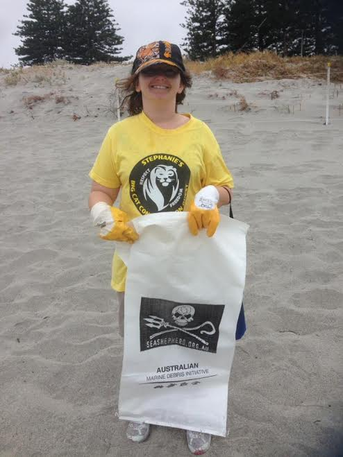

On Saturday the 28th of January 2017, Sea Shepherd held their Australia wide Marine Debris Clean up Initiative.  Stephanie and Angy from SBCCQ were there eager to help. We cleaned up South Beach in Fremantle.  We stayed for an hour in the wind and the rain, and picked up mostly cigarette butts.  South Beach and it's facilities are used by thousands of people.  Locals and visitors.  This is our home.  Please look after our home.  Pick up after yourself. Be accountable and Responsible.  Look at the big picture.  Not only is the local beach our responsibility, but so is our planet.  Be kind, be thoughtful, get involved.

Till Next week......................................
