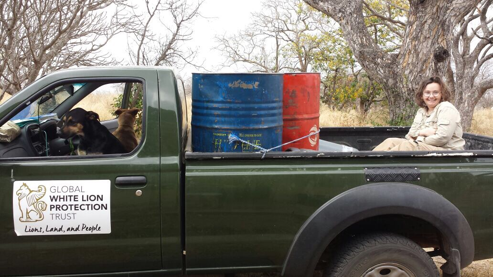

Stephs first week at the GWLPT has been filled with bush adventures with our amazing volunteer coordinator dorothee , lion checks, game counts, supplementing the lions, meeting new people and farm maintenance and upkeep. Oh and of course meeting some new lions! 

Stephs days start bright and early! At the latest we need to be up for 5:45, for the first checks on the lions. Sometimes even 5AM, when we check the lions on the other property. 

Stephs been helping with some of the property maintenance over the week - Living in the bush and volunteering with conservation isn't always as romantic as an African sunset! Diesel has to be provided to the farm, the next town is quite far away and not all vehicles can make the trip there.  So for Steph, that means a fun and bumpy ride into town on the back of the backkie! (pickup truck/ute)

_Steph on the back of the backkie, making sure those diesel drums don't fall over!_ 

Another job Steph has been helping with is filling up waterholes on the property! Valves have to be turned and water has to be directed to flow in the right direction.

A few times a week Steph needs to go out do game counts on the property. We always need to know numbers of animals for conservation purposes.

Sometimes on our way there ar cheeky branches that want to scratch our face! Oops! All part of the adventure though? Right? 

A very exciting trip was the one to Shidolo, a property further north of Mbube (where we are currently staying) On the 6th of September, just one day before Stephs arrival at the Trust, the trust were very pleased to successfully relocate 2 white lions back on their endemic land. Assegaia and Gaia, brother and sister, 4.5 years old from a reserve in the Eastern cap were safely flown in and are currently climatizing in the boma.

Zihra and Nebu, the residential lionesses are luckily not too curious about the new arrivals. That gives them more time to get used to the new area. One of Stephs first evenings here were spent with Lion ecologist Jason A. Turner, monitoring the new arrivals in the setting sun, talking about lion behaviour and waiting for possibly Zihra and Nebu to arrive.  Ending the day…not always as early as you think. Lions are active at night, and the best research results are taken during the dusk/night hours. 

To say the least, stephs first week back at the trust was packed with lots of fun and hard work. "It's good to be back!" Says Steph with a big smile!
