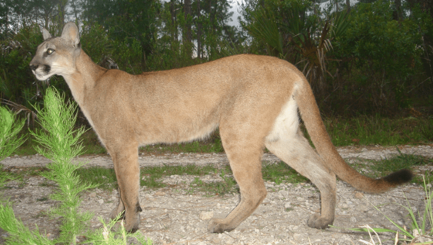
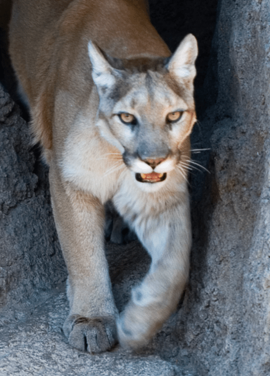
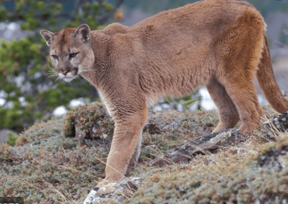

- A cougar has many different names: cougar, puma, mountain lion and panther.
- The cougar has the widest range in the Americas.
- There are some slight differences between these cats depending on where they live, but they are the same species. Just different subspecies.
- The Florida Panther has some differences in its coat: it has a slightly crooked tail, and a cowslick pattern in its fur on its back

- A mountain lion coat is usually has a white underside.

- A puma is slightly more muscular with more tan colours than white.

