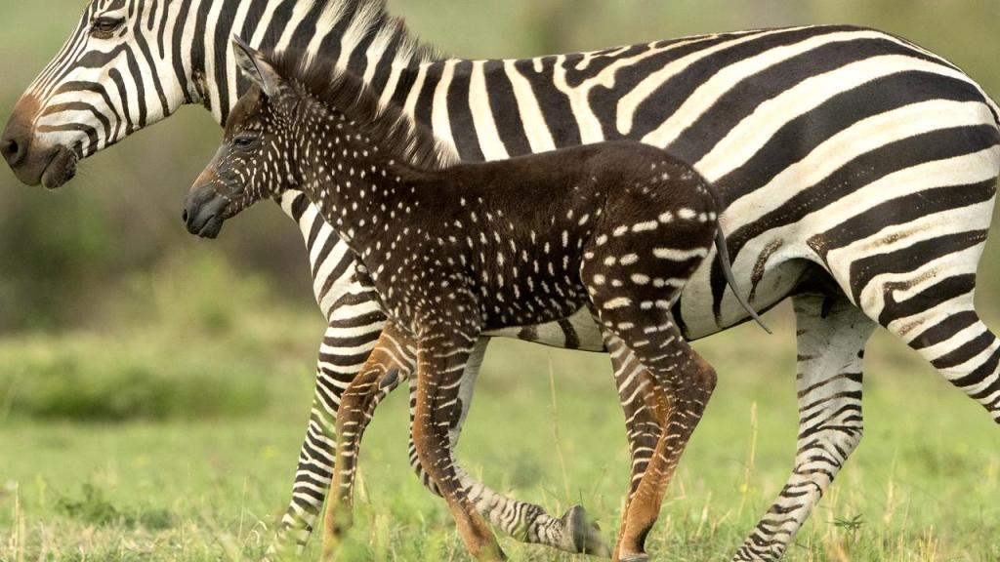

- This baby zebra was named Tira
- This baby has a genetic condition known as “pseudomelanism", which causes the zebra patterns to be different
- Tira’s appearance marks the first time that a spotted zebra has been seen at Masai Mara
- There are some concerns for the little Zebra's about the importance of Zebras having stripes (camouflage and social signaling) but Zebras have been found to be accepting of difference and this means that animals with different coat patterns still fit right into the herd

https://www.smithsonianmag.com/smart-news/spotted-kenya-baby-zebra-polka-dots-180973180/
