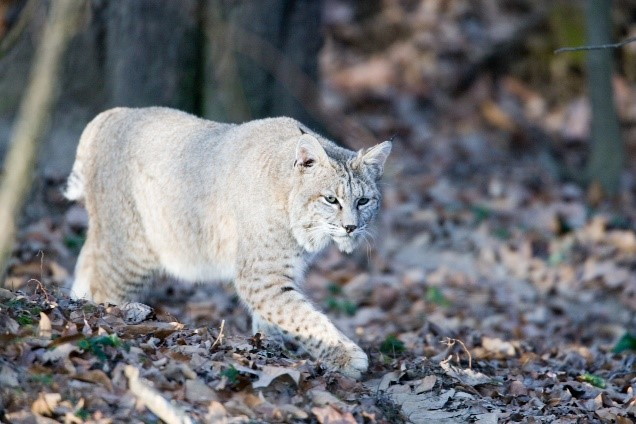
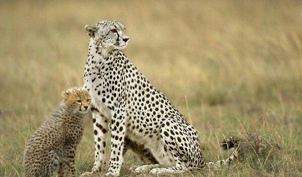
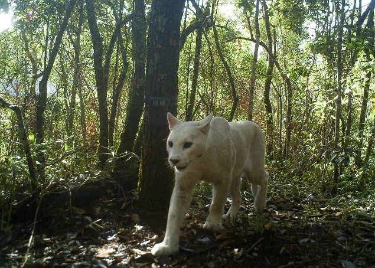
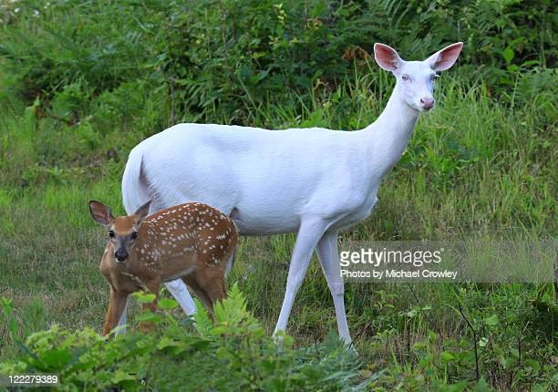
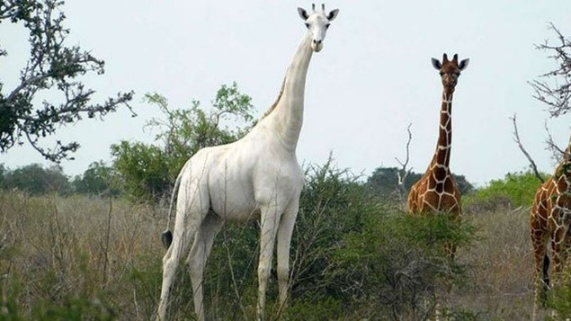
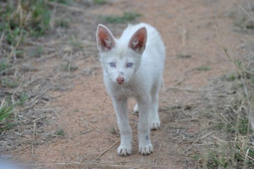
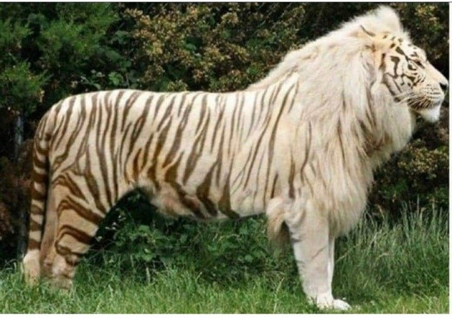
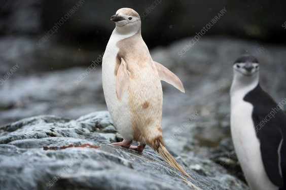
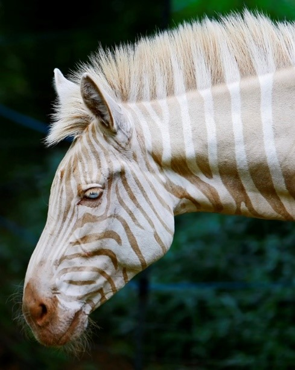
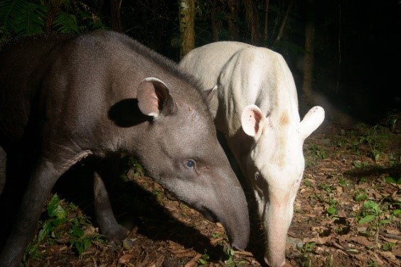

Steph has been looking into some animal species that are found to be albino (lacking pigment, or piebald (they have some normal colours and some not). Some of them are below (be aware these photos are not owned by SBCCQ and are used to refer to from other websites):

- 
    
- 
    
- 
    
- 
    
- 
    
- 
    
- 
    
- 
    
- 
    
- 
