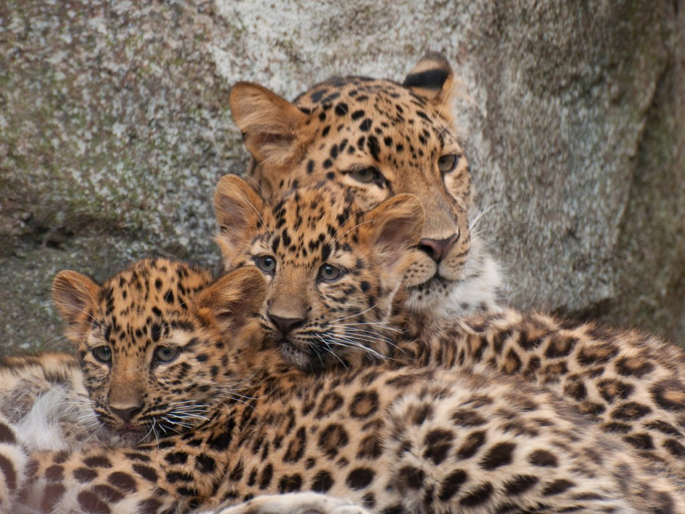

- Conservation status is Critically Endangered
- There are fewer than 80 individuals in the wild, found in the Russian far east
- They can be found in temperate, broadleaf and mixed forests
- The Amur leopard is adapted to the cool climate by having thick fur which grows up to 7.5 cm long in winter, and is paler than other leopards to camouflage with snow
- They live for 10 to 15 years of age in the wild
- It can leap up to a 5.5 metre distance, and they can jump 3 metres high
- Amur leopards normally hunt at night and need large territories to avoid competition for prey
- The cubs are born in litters of 1-4 individuals, with an average litter of 2, and the cubs stay with their mother for up to two years before becoming fully independent
- It has been reported that some males stay with females, and may even help with rearing the young
- Some threats for this species’ survival are forest fires, poaching and development.

Cited: [https://www.worldwildlife.org/species/amur-leopard](https://www.worldwildlife.org/species/amur-leopard)

