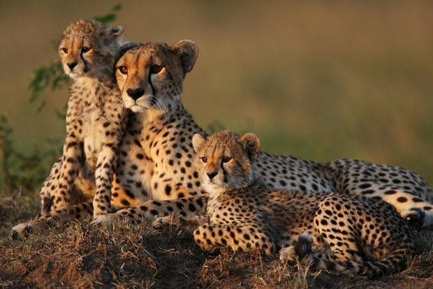

- The Asiatic Cheetah is a critically endangered subspecies of cheetah surviving only in Iran
- The African Cheetah’s scientific name is _Acinonyx jubatus_ whereas the scientific name for the Asiatic Cheetah is _Acinonyx jubatus venaticus_
- It is estimated that there are less than 50 individuals left in Iran in the wild, and they survive in protected areas in Iran’s plateau
- The Asiatic Cheetah lives in semi-desert regions but has also been found in mountainous terrain with dense vegetation
- They hunt during the day but if prey is scarce in an area, they have been known to also hunt at night
- The tail tip has black stripes on the Asiatic Cheetah, and its coat and mane are shorter than of African cheetah
- The head and body of an adult Asiatic cheetah measures 1.2 metres with a 66–84 cm long tail. And they weigh about 34–54 kg, making them overall smaller than the African Cheetah
- Evidence of females raising cubs successfully is rare, however it is suggested they have one to four cubs in a year
- Threats to their population include: local hunting, habitat loss and fragmentation, conflict with livestock farmers, and mining/road development
- There is a not-for-profit set up for the conservation of the Asiatic (or Iranian) Cheetah and they’re called _Iranian Cheetah Society_ and they currently have a project for the monitoring of the Asiatic Cheetah’s population

<figure>

<figcaption>

[https://en.mehrnews.com/news/167241/Four-Asiatic-cheetahs-spotted-in-central-Iran-VIDEO](https://en.mehrnews.com/news/167241/Four-Asiatic-cheetahs-spotted-in-central-Iran-VIDEO)

</figcaption>

</figure>

[https://www.wildlife.ir/en/](https://www.wildlife.ir/en/)
