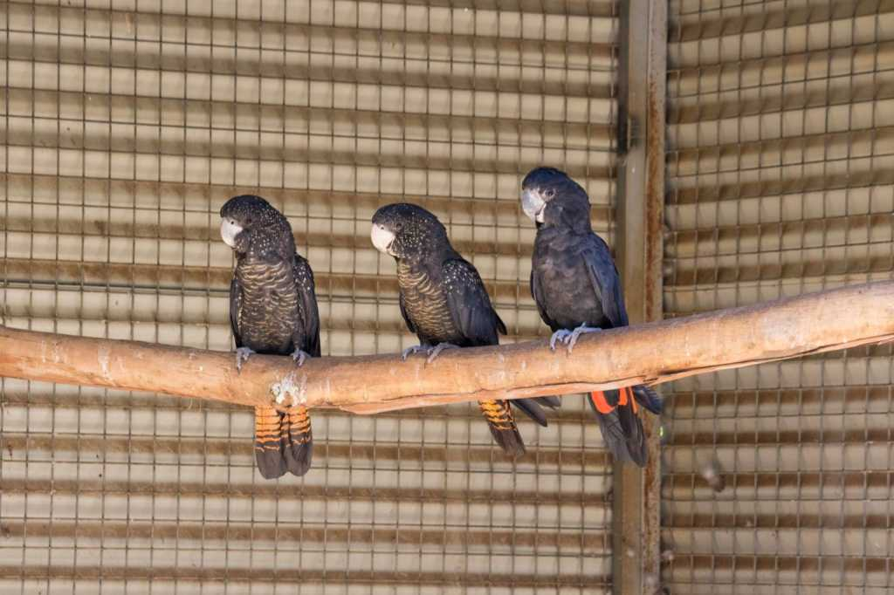
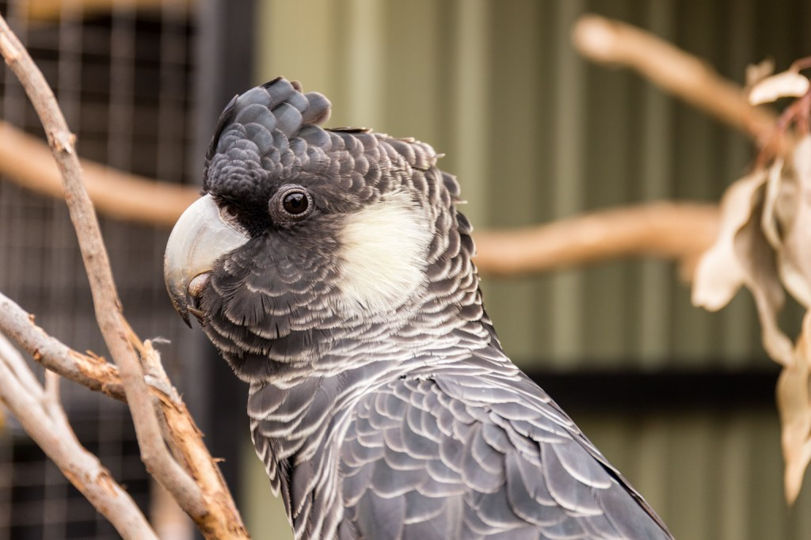
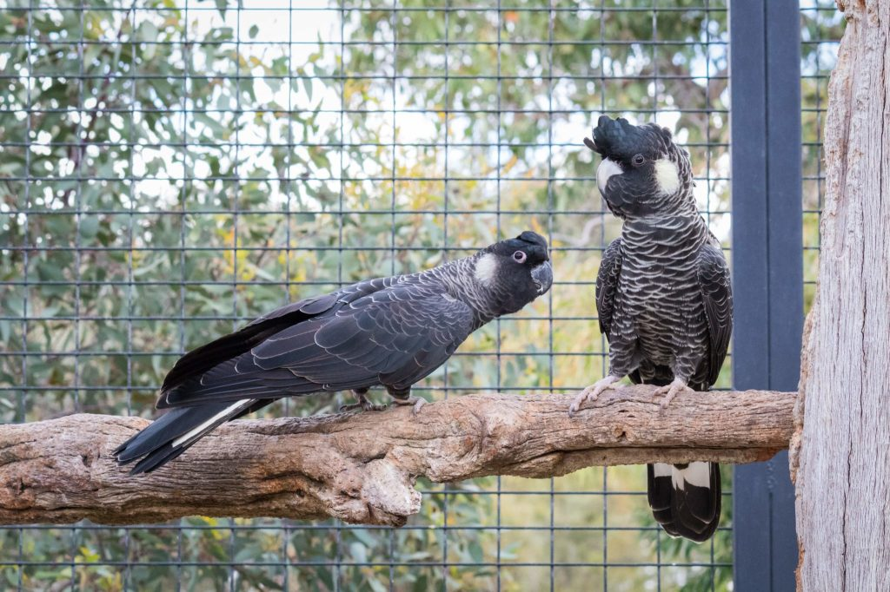

Black Cockatoos of Western Australia

- There are 3 types of Black Cockatoos in the south west of Western Australia
    
    - The Forest Red-Tailed Black Cockatoo
    
    - The Carnaby’s Black Cockatoo
    
    - The Baudin’s Black Cockatoo
- All of these species are under threat of extinction due to habitat loss, conflict with humans, illegal poaching and competition for nesting hollows by Corellas, Galah and feral bees
- Black Cockatoos are very social and will fly in large groups, or in small family groups
- There are slight differences in habitat for these three species:
    
    - Carnaby’s prefer the low banksia/heath woodlands
    
    - Baudin’s and Forest Red-Tailed Cockatoos prefer Marri and Jarrah forests
- Below are estimates of the numbers of black cockatoos left in the wild in our region:
    
    - Carnaby’s cockatoos – 40,000
    
    - Baudin’s cockatoos – 12,000
    
    - Forest Red Tail cockatoos – 15,000

These birds are definitely in need of our support, and you can go and visit them to learn more at the Kaarakin Black Cockatoo Conservation Centre in Martin, near Kelmscott.

<figure>

<figcaption>

Courtesy of: [https://blackcockatoorecovery.com/types-of-black-cockatoos/](https://blackcockatoorecovery.com/types-of-black-cockatoos/)

</figcaption>

</figure>

<figure>

<figcaption>

Courtesy of: [https://blackcockatoorecovery.com/types-of-black-cockatoos/](https://blackcockatoorecovery.com/types-of-black-cockatoos/)

</figcaption>

</figure>

<figure>

<figcaption>

Courtesy of: [https://blackcockatoorecovery.com/types-of-black-cockatoos/](https://blackcockatoorecovery.com/types-of-black-cockatoos/)

</figcaption>

</figure>
