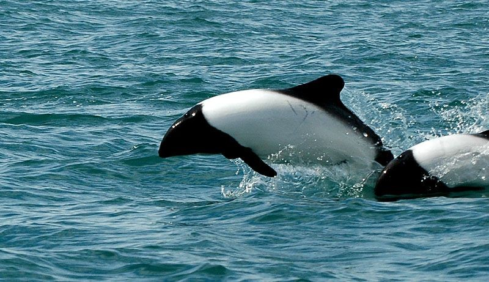

- These dolphins only live in the south tip of South America, and Kerguelen Islands south of Africa. These are two separate subspecies.
- _Cephalorhynchus commersonii commersonii_  (South America) has a sharper edge to its pattern, where as _Cephalorhynchus commersonii kerguelenensis_ has less contrast.
- Sexes are easily distinguished by the different shape of the black blotch on the belly — it is shaped like a teardrop in males but is more rounded in females.
- They often seen swimming rapidly on the surface and leaping from the water. It also spins and twists as it swims.
- They are also known to swim upside-down, which is thought to improve the visibility of its prey.
- They hunt at night in groups using echolocation.
- Baby Commerson’s dolphins are not black and white, they are grey all over and change colour as they get older.
- Both males and females grow to 1.8m in length and weigh about 86kg.
- On 13 November 2004, a Commerson’s dolphin was seen swimming off the coast of South Africa which is over 4000km from the Kerguelen Islands and more than 6000km from South America.
- They are under threat due to ocean pollution and catch nets.

<figure>

<figcaption>

  
[https://au.whales.org/whales-dolphins/species-guide/commersons-dolphin/](https://au.whales.org/whales-dolphins/species-guide/commersons-dolphin/)

</figcaption>

</figure>
