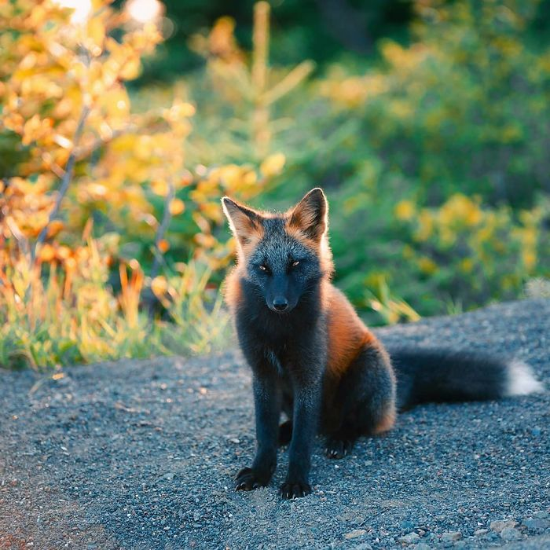
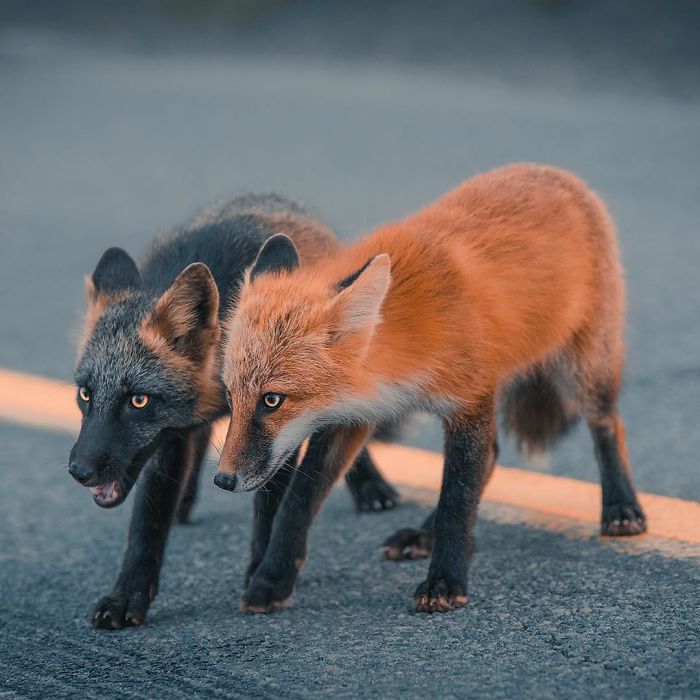

- Cross foxes are basically red foxes with partial melanism or full melanism
- Melanism is a gene variant where there is extra melanin in the skin, causing a deep black colour. In animals, that includes their fur
- The “Fire fox” is a variant with partial melanism.
- Officially, Sam Gaby is an economist and policy advisor but he’s been a photographer way longer. He was the one to photograph this beautiful “Fire fox”
- This fox lives in Twillingate, Newfoundland

<figure>

<figcaption>

Image credits: Sam Gaby

</figcaption>

</figure>

<figure>

<figcaption>

Image credits: Sam Gaby

</figcaption>

</figure>

https://www.boredpanda.com/black-orange-cross-fox-photo-sam-gaby/?utm\_source=google&utm\_medium=organic&utm\_campaign=organic
