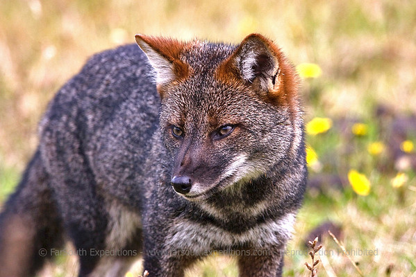

- Conservation status is Endangered (was downgraded from Critically Endangered in 2016)
- There are currently 227 individuals on the mainland of South America and 412 on Chiloé Island (off the southern coast of Chile)
- Darwin's fox is differentiated from the South American gray fox: shorter legs; broader and shorter skull; more robust teeth; and a different jaw shape
- Their habitat is southern temperate rainforests, and they are most active at twilight and before sunrise
- Average weight is from 1.8 to 3.95 kg, a head-and-body length of 48 to 59 cm, and a tail that is 17.5 to 25.5 cm
- It is suggested that Darwin's foxes are monogamous and form pairs that only breed once a year in October
- They give birth to a litter of 2-3 kits and both parents look after them
- They are the smallest of all fox species
- It has been over 180 years since Charles Darwin first encountered this charismatic fox and still to this day, very little is known about them
- It has a thick coat of greyish-black with rust-like colouring on the legs and around the ears, and a dark grey tail, and sometimes a white band can be seen across the chest.

[farsouthexpeditions.smugmug.com/Wildlife-Fauna/The-Mammals/Darwins-Fox-Pseudalopex-fulvipes/i-ggTtg94(opens in a new tab)](https://farsouthexpeditions.smugmug.com/Wildlife-Fauna/The-Mammals/Darwins-Fox-Pseudalopex-fulvipes/i-ggTtg94)
