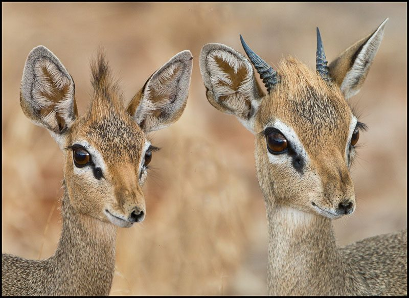

- Dik-diks stand about 30 to 40 cm  in height at the shoulder, they are 50 – 70cm in length, and they weigh between 3 and 6 kg. A very small antelope!
- There are four different species of Dik-dik:
    
    - Günther's dik-dik
    
    - Kirk's dik-dik
    
    - Silver dik-dik
    
    - Salt's dik-dik
- The males are a lot smaller than the females and only the males have horns
- The dik-dik gets its name from the short dik-dik whistle sound that the female makes through her snout when threatened
- Dik-diks live in shrublands and savannas of eastern Africa
- Dik-diks are monogamous and females only have one fawn at a time (although they can have two fawns per year because they are pregnant for approx. 5 – 6 months)
- Unlike other ruminants (such as cattle, sheep, goats, buffalo, deer, elk, giraffes and camels) which have their young born forefeet first, the dik-dik is born nose first, with its forelegs laid back alongside its body
- Apparently to prevent overheating, dik-diks have elongated snouts with bellows-like muscles through which blood is pumped.
- Mostly nocturnal, they avoid the heat of the day; this also helps them prevent unnecessary water loss
- Dik-diks' adaptations to predation include excellent eyesight and the ability to reach speeds up to 42 km/h

<figure>

<figcaption>

[https://blog.goway.com/globetrotting/dik-diks-mate-for-life/](https://blog.goway.com/globetrotting/dik-diks-mate-for-life/)

</figcaption>

</figure>

https://en.wikipedia.org/wiki/Dik-dik

https://www.awf.org/wildlife-conservation/dik-dik
