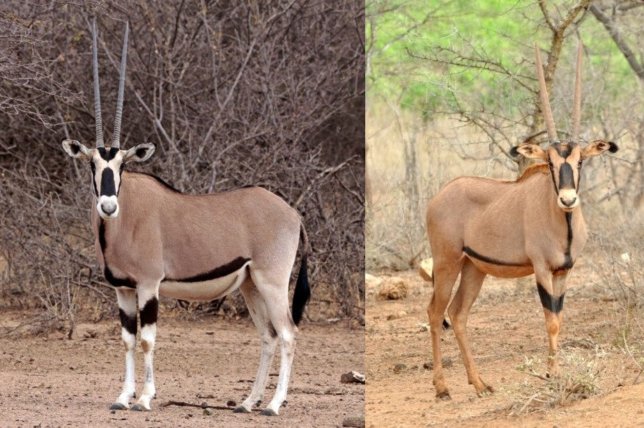

- The East African Oryx has two distinct subspecies: Common Beisa Oryx _(Oryx beisa beisa)_ and the Fringe Eared Oryx _(Oryx beisa callotis)_
- The Common Beisa Oryx is listed as Endangered, and the Fringe-Eared Oryx is listed as Vulnerable
- Both subspecies live in the deserts of eastern Africa, currently residing in Ethiopia, Kenya and Tanzania (with some found in southern Sudan and Somalia)
- They both eat grasses, leaves, fruit and buds, and in summer they can eat poisonous Adenium plants
- They feed during the day when the plants hold the most water
- They are able to store water by raising their body temperatures, therefore avoiding water loss through sweating, and this allows them to survive long periods without water travelling through the desert
- The two East African Oryx species differ from the Gemsbok _(Oryx gazella)_ in southern Africa, in that they have tufts of fur on the ends of their ears and they are slightly smaller
- They live in herds of up to 600 animals
- Newborn calves are able to run with the herd immediately after birth
- The main threats to their population is hunting for their horns, meat and coat, and habitat loss from human expansion

<figure>

<figcaption>

[https://en.wikipedia.org/wiki/East\_African\_oryx](https://en.wikipedia.org/wiki/East_African_oryx)

</figcaption>

</figure>
