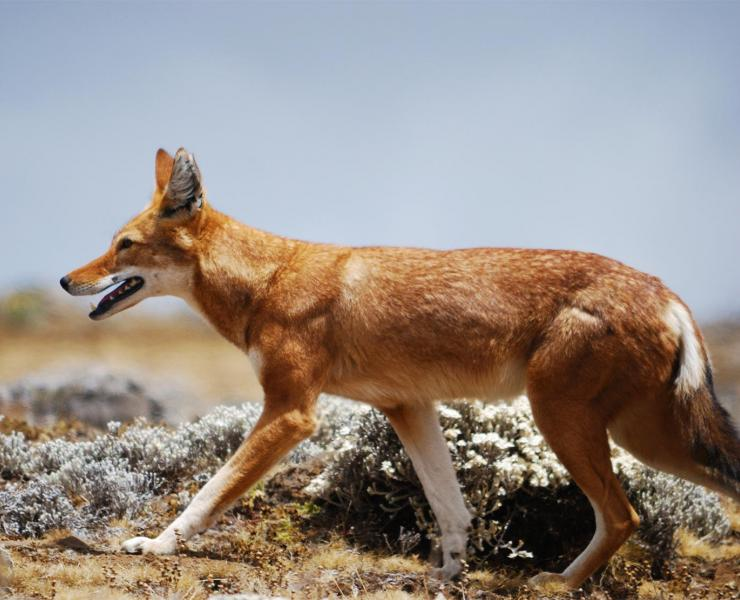

- Their habitat is Afro-alpine grasslands, rocky areas, and shrublands in Ethiopia
- There are fewer than 440 individuals remaining in the wild. They are classified as Endangered.
- They are long-limbed and slender in build. They have a black, bushy tail, pointed ears, and a slender snout.
- They are tawny red with a white underbelly and blaze on their chests, and also have white fur on their throats.
- Females tend to be paler in colour than the males.
- Litters consist of two to six pups, and the pups are born toothless and with their eyes closed.
- They can weigh between 11 and 20 kg, and they can reach 1 metre in length
- They can live up to 10 years of age
- Adult wolves in a pack will help raise each other’s pups. Wolf mothers give birth in a den they dug themselves, under a boulder or inside a rocky crevice.
- Currently, humans are their biggest threat to their survival. This is due to agriculture resulting in a significant loss of the wolves’ habitat.

<figure>

<figcaption>

[https://www.awf.org/wildlife-conservation/ethiopian-wolf](https://www.awf.org/wildlife-conservation/ethiopian-wolf)

</figcaption>

</figure>
