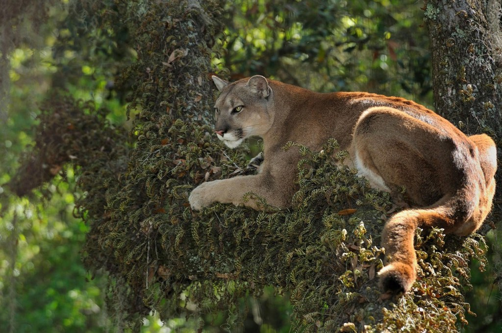

- Conservation status is Endangered
- Florida panthers are a subspecies of the mountain lion
- The breeding range of the Florida panther population is currently restricted to habitat south of the Caloosahatchee River
- Potential panther habitat continues to be affected by urban development, road construction, and land clearing for agriculture and mining
- Males are 60 to 70 cm at the shoulder and 45 to 72 kg for males, whereas females are 31 to 45 kg pounds. They can be up to 2 metres long from nose to the tip of their tail
- There are an estimated 120-230 adults and subadults primarily in southwest Florida
- Female panthers can have between 1 and 4 kittens and they stay with their mother for 2 years
- Florida panther kittens have blue eyes, and a spotted coat which helps to camouflage them better from potential predators
- Panthers are mostly active between dusk and dawn, resting during the heat of the day
- The main way to tell a Florida panther from other subspecies of mountain lion is by looking at the tail and back. Florida panthers have a crooked tail and a unique patch of fur that is like a cowlick on their back

