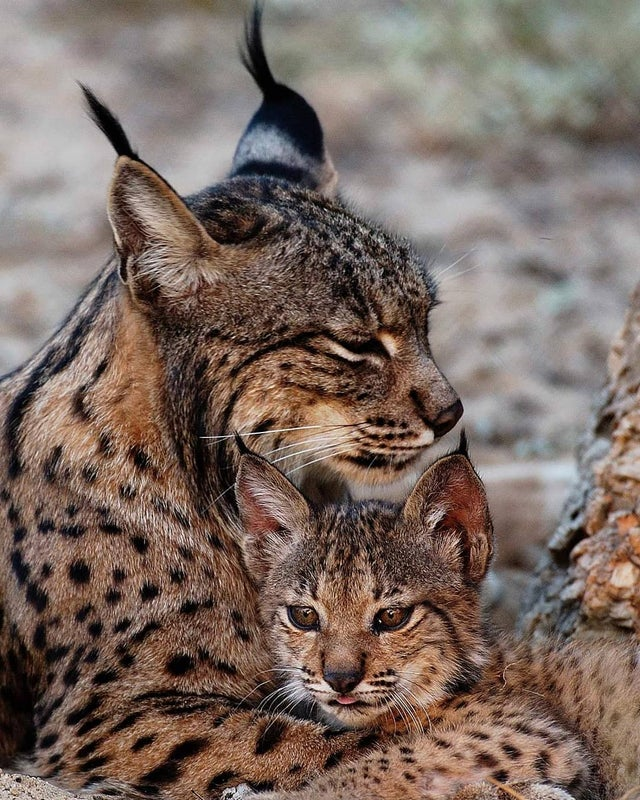

**Iberian Lynx**

- The Iberian lynx is the world's most endangered feline species. However, conservation measures have seen its population inch above 400.
- Its coat is tawny with dark spots and it bears a characteristic "beard" around its face and prominent black ear tufts.
- Size range of the Iberian Lynx is 10-13kg in weight and 88-100cm in height.
- The average litter size is 3, with rarely more than 2 young surviving weaning due to habitat loss.
- The Iberian lynx was found in Spain, Portugal and Southern France.  It declined steadily during the 20th century, and at the beginning of the 2000s only two isolated breeding populations currently exist.
- Threats include habitat loss from infrastructure leading to food scarcity, car hits from roads, and illegal hunting.
- Conservation measures include restoring its native habitat, maintaining the wild rabbit population, reducing unnatural causes of death, and releasing captive bred individuals.
- The Iberian lynx lives in Mediterranean forests composed of native oaks and abundant undergrowth and thickets.
- Iberian Lynx show a great deal of seasonal and individual variation in activity levels. In summer they are nocturnal and crepuscular but in winter they are active during the daylight hours.
- The mating call of the Iberian Lynx is like a loud meow or howl.

<figure>

<figcaption>

  
[https://www.reddit.com/r/Awwducational/comments/g1e7g8/iberian\_lynx\_kittens\_nurse\_until\_they\_are\_10/](https://www.reddit.com/r/Awwducational/comments/g1e7g8/iberian_lynx_kittens_nurse_until_they_are_10/)

</figcaption>

</figure>
