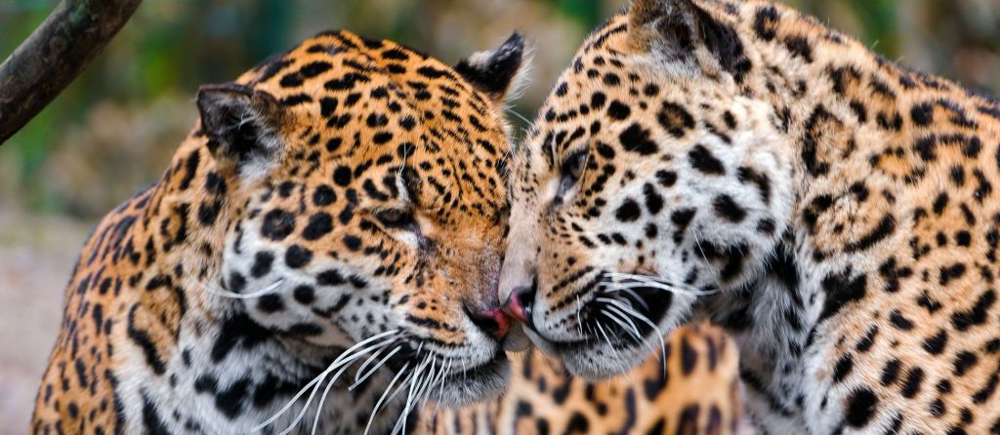

- Conservation status is Near Threatened
- As of January 2021, conservation groups estimate that there are about 15,000 jaguars left in the wild
- The jaguar's range extends from southern Arizona in the United States, across Mexico and the Amazon rainforest, and also to the south to Paraguay and in northern Argentina
- The jaguar is the only living species of _Panthera_ that is native to the Americas (other species in the _Panthera_ family include lion, leopard, snow leopard and tiger)
- The jaguar is a solitary animal, and they roar and grunt to communicate to other jaguars over long distances
- Females can have one to two cubs and the cubs stay with their mother for up to 2 years before going off on their own
- They average 1.8m in length, and can weigh up to 96kg (jaguars in Mexico are smaller than jaguars in Brazil mostly because of the presence of other predators such as the cougar)
- Jaguars are an apex predator which means they are at the top of the food chain and it’s a keystone species because they control other animals’ populations in the food chain
- Jaguars are excellent swimmers and are known to cross large rivers
- The threats to their population are: habitat loss, habitat fragmentation, and poaching for trade

[https://en.wikipedia.org/wiki/Jaguar](https://en.wikipedia.org/wiki/Jaguar)

<figure>

<figcaption>

[https://wildfor.life/species/jaguar](https://wildfor.life/species/jaguar)

</figcaption>

</figure>
