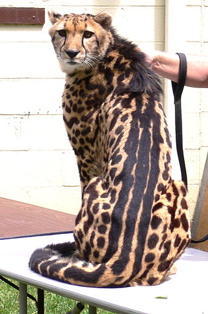

- The top speed is 80 to 130 kpm
- They are not a distinct species, but instead a genetic variation (the markings are from a recessive gene)
- Cheetahs do not roar, they meow and purr
- The King Cheetahs can only be found in Zimbabwe, Botswana and the Northern Transvaal.
- The conservation status of the King Cheetah is Vulnerable with its population decreasing.
- The highest a King cheetah can jump is around 12 feet
- The longest yard or leap distance of a King Cheetah is 39 feet
- King Cheetah mothers have between 2 and 6 cubs, but there was a rare birth in 2014 of 8 cubs
- Only 10 are believed to exist in the wild with a further 50 in captivity
- Their spots act as camouflage while they wait in the tall grass or perched up high in the dappled light of an acacia tree.

