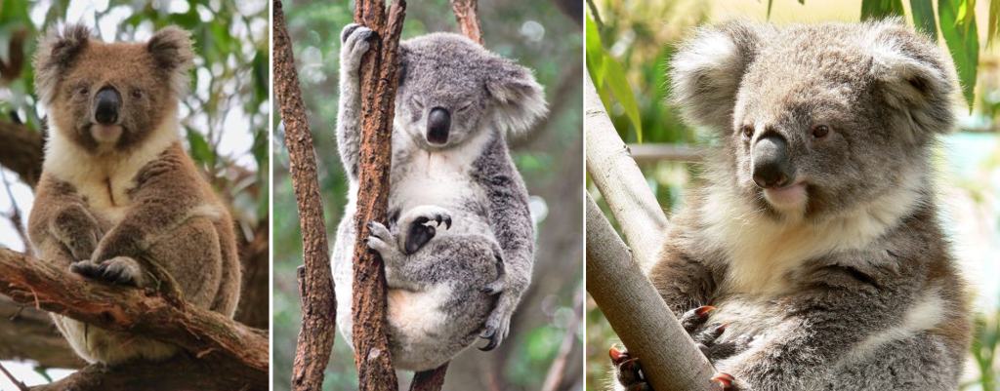

- Conservation status overall for Koala is Vulnerable
- Mostly found in the eastern states of Australia
- Koala came from _Dharug gula_ meaning no water because koalas were not seen coming down for a drink, but it was found later they just don’t drink as often as eucalyptus leaves have a high water content
- Types of Koalas: Brown Koalas (VICTORIAN REGION); Grey Koalas (QUEENSLAND REGION); and Grey-Brown Koalas (NEW SOUTH WALES REGION)
- The tiny joey makes its way from the birth canal to the pouch without any help from its mother
- After 6 months the joey will ride on his mum’s back and only sleep and eat in the pouch
- Koala sleep during the day and mostly active at night, but they can sleep up to 18 hours of the day
- Koalas can eat up to a kilogram a day and have a special digesting organ (caecum) that helps them detoxify the poisonous eucalyptus leaves
- Koala have poor vision but excellent sense of smell and very acute hearing
- Koala have two thumbs per front paw that helps them with climbing quickly

