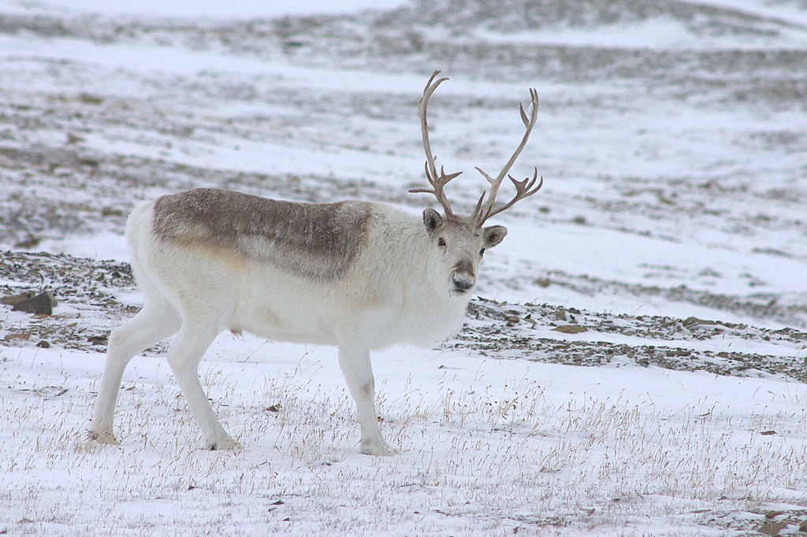
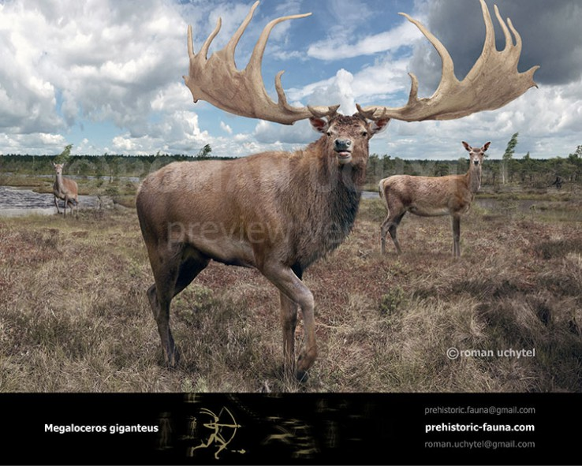

- The Peary Caribou is a subspecies of Caribou and they live in the Arctic islands as well as Canada
- Their conservation status is Endangered, and the main cause of this is climate change leading to more ice layers in the snow which reduces the available food for them to forage
- Females weigh almost half of the males at 60kg, and males weigh around 110kg
- Peary Caribou love the plant “Purple Saxifrage” in summer, which makes their lips purple
- Their hooves are shaped like a shovel, which helps them dig in the snow in search of food
- These Caribou travel around 150km searching for food, and they are good swimmers
- In Winter, their coat turns white and is very thick but in Summer it is thinner and darker
- Population numbers have declined by 72% in the last 60 years, with only around 13,000 individuals left
- They have an ancient ancestor by the name of _Megaloceros giganteus_ and he was a very large animal
- All Caribou species can be considered the wild reindeers!

<figure>

<figcaption>

[https://www.flickr.com/photos/nrthrnrctc/3048328207](https://www.flickr.com/photos/nrthrnrctc/3048328207)

</figcaption>

</figure>

<figure>

<figcaption>

[https://prehistoric-fauna.com/Megaloceros-giganteus](https://prehistoric-fauna.com/Megaloceros-giganteus)

</figcaption>

</figure>
