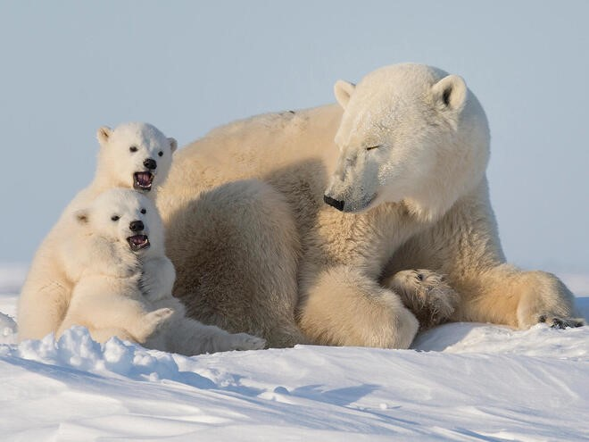

- The Polar lives in the Arctic region in its surrounding seas and land masses
- They have black skin under their translucent fur (which reflects the visible light around them)
- Because they spend most of their lives on the sea ice of the Arctic Ocean, polar bears are the only bear species to be considered marine mammals
- They have blue tongues!
- Only 2% of hunts are successful and so most of the food that polar bears eat is scavenged food
- The polar is the largest living bear species, as well as the largest living land carnivore
- A male polar bear is called a boar and a female polar bear is called a sow
- They can smell food or their prey from over a kilometre away
- Polar bears can swim constantly for days at a time swimming from one location to another for food.
- Polar bears roll around in the snow to clean and dry their fur. Polar bears like to be clean and dry because matted, dirty, and wet fur is a poor insulator

<figure>

<figcaption>

[https://www.worldwildlife.org/species/polar-bear](https://www.worldwildlife.org/species/polar-bear)

</figcaption>

</figure>
