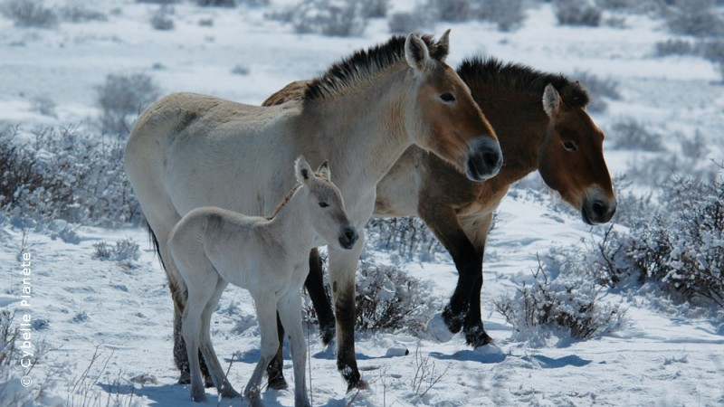

- Przewalski's Horse, also called the takhi, Mongolian wild horse or Dzungarian horse
- Przewalski's horse is a wild horse living in Mongolia, and is similar to other wild horse species like the American mustang or the Australian brumby
- Their conservation status is listed as Threatened
- These horses were once extinct in the wild, but in the 1990s they were reintroduced into National Parks such as e Khustain Nuruu National Park
- They can be 122–142 cm in height, and 2.1m in length
- These horses form troops of between five and fifteen members, consisting of an old stallion and his mares and foals
- They maintain communication within their herds, with each kick, groom, vocalisation, tilt of the ear, or other contact with any another horse as a means of communicating
- Usually these horses give birth to one foal, and foals are able to stand about an hour after birth
- Conservation threats include over-hunting, poaching, harsh winters, and habitat loss
- One herd in Ukraine was slaughtered by German soldiers during World War II. In 1945, there were just 31 remaining in the world and by the end of the 1950s, only 12 individuals remained. All of the Przewalski’s horses today are descendent of those 31 individuals ([https://blogs.scientificamerican.com/thoughtful-animal/10-things-you-didne28099t-know-about-przewalskie28099s-horses/](https://blogs.scientificamerican.com/thoughtful-animal/10-things-you-didne28099t-know-about-przewalskie28099s-horses/))

<figure>

<figcaption>

[https://www.cybelle-planete.org/en/missions-mongolie/details/5/15-ecovolontariat-chevaux-przewalski-mongolie.html](https://www.cybelle-planete.org/en/missions-mongolie/details/5/15-ecovolontariat-chevaux-przewalski-mongolie.html)

</figcaption>

</figure>
