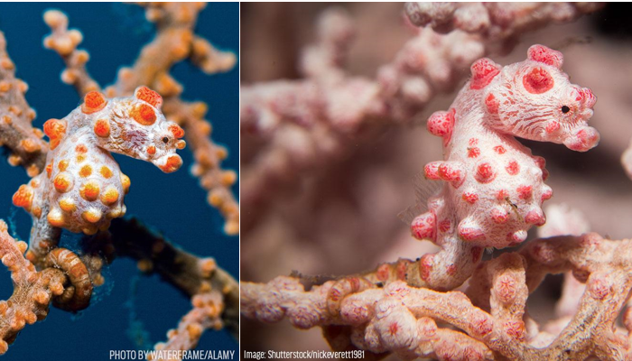

- Pygmy Seahorses live in coastal waters of Indo-West Pacific Ocean
- The Bargibant’s pygmy seahorse was discovered accidentally in 1969 on a gorgonian coral being examined and was the first pygmy seahorse species to be discovered
- The Bargibant’s pygmy seahorse is usually one of two colours: purple with pink tubercles or yellow with orange tubercles, depending on the host gorgonian’s colour
- They live at depths of 16-40 m
- Pygmy seahorses presumably feed on small crustaceans but more research is needed to confirm it
- Pygmy Seahorses grow to an average of 1.4 to 2.7 cm
- Pygmy seahorses give birth to live young like all other Seahorses
- Breeding pairs of Pygmy seahorses are possibly monogamous
- The male broods the eggs in his pouch and then can give birth to up to 34 young
- Coral reef degradation, habitat loss, ocean acidification and rising ocean temperatures are some of the threats the pygmy seahorses face

<figure>

<figcaption>

[https://oceana.org/marine-life/ocean-fishes/pygmy-seahorse](https://oceana.org/marine-life/ocean-fishes/pygmy-seahorse)

</figcaption>

</figure>
