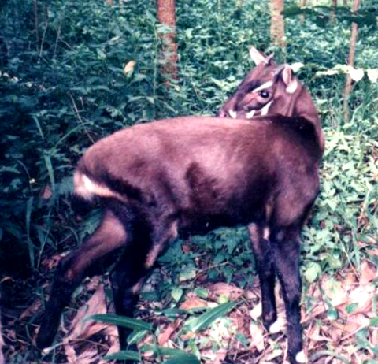

- Conservation status is Critically Endangered
- There are fewer than 750 animals in the wild
- They have been called the “Asian Unicorn” due to their rarity and their gentle nature, although Saola actually means “Spindle Horn” due to their parallel horns
- Saola inhabit wet evergreen or deciduous forests in eastern Southeast Asia, preferring river valleys
- The threats to their survival have been habitat loss through urbanisation, local hunting and sourcing for local medicine
- Both females and males have horns, although females have shorter horns than the males
- They stand 0.8 metres at their shoulder, and weigh between 80 to 100 kg
- The Saola is a strong symbol of biodiversity in Laos and Vietnam
- Its’ closest living relatives are local cattle and buffalo (part of the bovine family)
- The Saola occurs only in the Annamite Mountains, along the border of Vietnam and Laos, and therefore it has one of the smallest ranges of any large mammal

<figure>

<figcaption>

[https://en.wikipedia.org/wiki/Saola](https://en.wikipedia.org/wiki/Saola)

</figcaption>

</figure>
