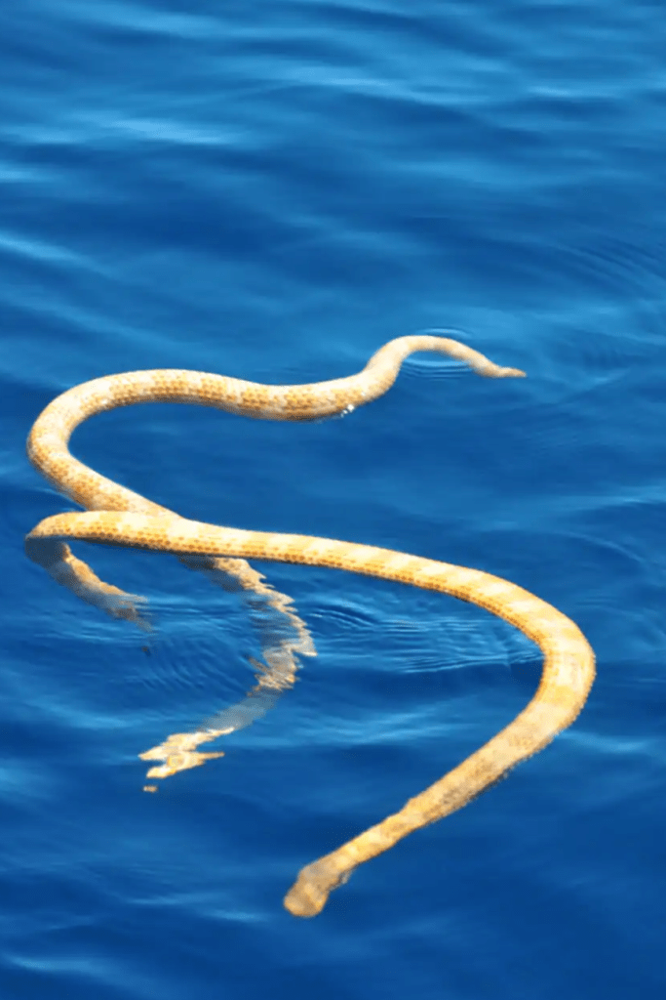

- Conservation status is Critically Endangered
- This snake had been thought to be extinct until 2015 when they were sighted in the Ningaloo Reef
- The original habitat known before the sighting was Ashmore Reef in the Timor Sea
- The snake can be found in waters 10m but rests in shallow water up to 2m in depth
- The short-nosed sea snake grows up to 60cm long, is relatively slender and has a small head
- These snakes shed their skin every 2 to 6 weeks
- They have a gland under their tongue that helps them rid water from excess salt
- They can spend up to two hours under water because of the snake’s single lung which is nearly the length of its body
- The snake gives birth to live young, with a gestation period of six to seven months
- Prawn fishing trawlers and global warming are the two suspected threats to their population

<figure>

<figcaption>

https://www.livescience.com/53190-endangered-sea-snakes-found-in-australia.html

</figcaption>

</figure>
