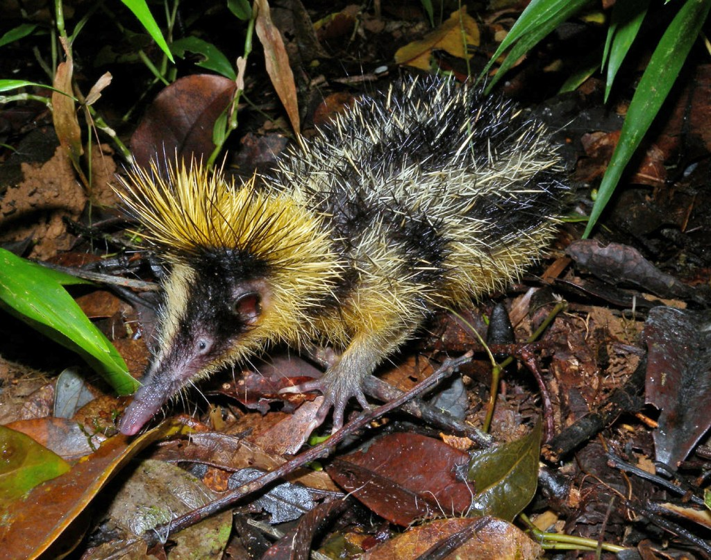

- They are only found on Madagascar, no where else in the world.
- They live in the northern and eastern tropical lowland rainforests on the island.
- Their life span is only approx. 2.5 years.
- They are active both during the day and during the night depending on the climate.
- They have bright yellow and black porcupine-like quills.
- Depending on the climate, they go in and out of a torpor state. This is similar to the hibernation survival tactic but its involuntary, meaning it's dictated by the conditions rather than planned by the animal.
- They can communicate using their quills if they need to find each other.
- Their diet is mainly earthworms and insects.
- They in family groups within burrows.
- Their main threats are deforestation on Madagascar, as well as being hunted for meat.

<figure>

<figcaption>

https://en.wikipedia.org/wiki/Lowland\_streaked\_tenrec

</figcaption>

</figure>
