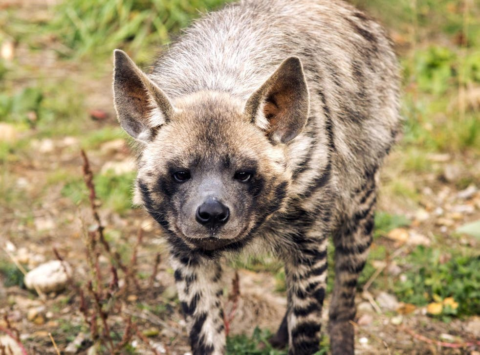

- The Striped Hyena’s Conservation Status is Near Threatened
- The Striped Hyena is not only native to North and East Africa, it’s also found in Asia, India and the Middle East
- Hyenas in general, although they resemble dogs, are actually closely related to cats (they are part of the _Feliformia_ suborder, whereas dogs are part of the _Caniformia_ suborder).
- They are monogamous and both the male and female assist one another in raising their cubs
- Striped Hyenas are nocturnal and they only come out after sunset, and return to their dens before sunrise
- They weigh between 22 and 55 kg, and a length between 85 to 130 cm
- Striped hyena cubs are born with adult markings, closed eyes and small ears (with a closed ear canal, making it hard for them to hear)
- A breeding pair will have 2 to 4 cubs at a time
- They are scavengers but have been known to make a kill if the opportunity arises, they generally follow other predators to get their food (in the Middle East and in Asia they follow packs of grey wolves)
- Conservation threats include: hunting by humans, habitat loss, and reductions in their prey populations.

<figure>

<figcaption>

[https://www.independent.co.uk/news/world/lebanon-striped-hyena-conservation-beirut-kfar-toun-africa-a9184351.html](https://www.independent.co.uk/news/world/lebanon-striped-hyena-conservation-beirut-kfar-toun-africa-a9184351.html)  
  
[https://en.wikipedia.org/wiki/Striped\_hyena](https://en.wikipedia.org/wiki/Striped_hyena)

</figcaption>

</figure>
