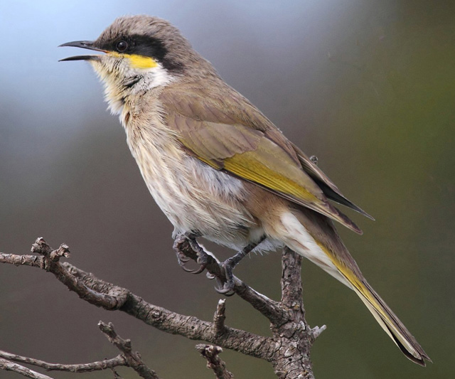
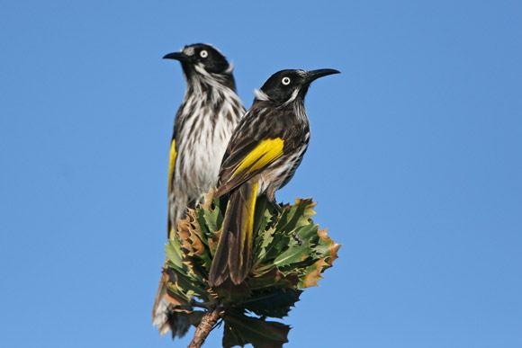
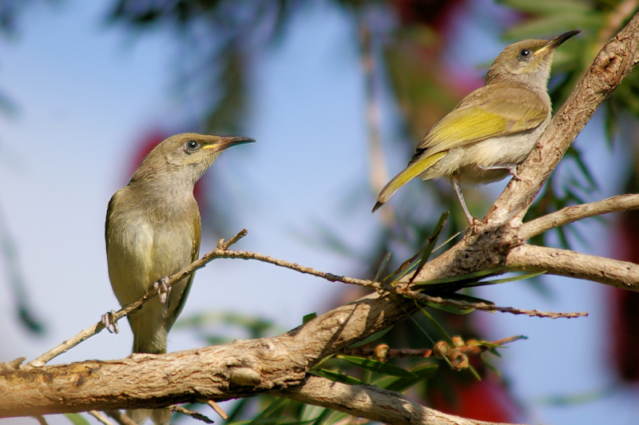

There were a 3 species of honeyeaters that we observed this week: Singing Honeyeater, the New Holland Honeyeater, and the Brown Honeyeater.

**Singing Honeyeater**

- The Singing Honeyeater (_Lichenostomus virescens_) is one of Australia’s most widespread species of honeyeater
- The Singing Honeyeater forms monogamous pairs, with some long-term bonds
- The Singing Honeyeater feeds on nectar, insects and fruit. It forages in low shrubs or on the ground

**New Holland Honeyeater**

- The New Holland Honeyeater (_Phylidonyris novaehollandiae_) is one of Australia’s most energetic birds
- Both sexes of the New Holland Honeyeater feed the chicks, a pair of adults may raise two or three broods in a year
- New Holland Honeyeaters are active feeders and they mostly eat the nectar of flowers, and busily dart from flower to flower in search of this high-energy food

**Brown Honeyeater**

- The Brown Honeyeater (_Lichmera indistincta_) is widespread in northern Australia as well as parts of the eastern and western regions, where it inhabits a range of wooded habitats
- The male Brown Honeyeaters defend a nesting territory by singing from tall trees and they stand guard while the female builds the nest and lays the eggs
- The Brown Honeyeater feeds on nectar and insects, foraging at all heights in trees and shrubs. It may be seen in mixed flocks with other honeyeaters

https://www.birdlife.org.au/bird-profile/singing-honeyeater

https://www.birdlife.org.au/bird-profile/new-holland-honeyeater

https://birdlife.org.au/bird-profile/brown-honeyeater

https://backyardbuddies.org.au/backyard-buddies/singing-honeyeater

https://dl.id.au/1/g.php?c=1&i=281
