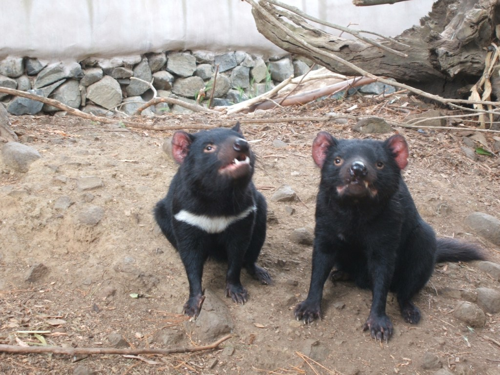

- Scientific name is _Sarcophilus harrisii_ and they are an endangered carnivorous marsupial
- They used to be found only in Tasmania, but they have now been reintroduced to the mainland of New South Wales in Australia
- They are solitary and are most active at night, meaning they are nocturnal
- Tasmanian devils are a keystone species. Keystone species play a critical role in maintaining the structure of an ecological community
- Females give birth to 20 – 30 live young, but they only have four nipples in their pouch, which results in 60% of the young pups not surviving to maturity
- Their front legs are slightly longer than their back legs and they can run up to a surprising 13km per hour
- Most Tasmanian devils have a white patch on their chest, however in the wild 16% of them show no markings at all
- Males are usually larger than females, weighing around 8kg. Females usually weigh around 6kg.
- They have four fingers facing forward and one finger out to the side, meaning they can hold their food. They have non retractable claws.
- Young Tasmanian Devils can climb trees, but lose this ability as they grow. They have also been known to swim quite well

<figure>

<figcaption>

[https://en.wikipedia.org/wiki/Tasmanian\_devil](https://en.wikipedia.org/wiki/Tasmanian_devil)

</figcaption>

</figure>
