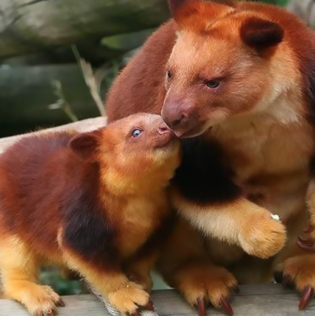

- There are a 14 species of Tree Kangaroo, the two species that live in Australia are: Lumholtz’s Tree Kangaroo and Bennet’s Tree Kangaroo
- Tree Kangaroos lives in tropical rainforests in New Guinea and far north Queensland
- The general conservation status across all species is Threatened, and the main threats for all species are hunting and habitat loss
- The Tree Kangaroo is the only arboreal marsupial, and is also the largest arboreal mammal in Australia
- Female Tree Kangaroos only give birth to one joey per year
- Breeding takes place in the tree tops (very cautiously!)
- They can run up to 70 km/hr if they need to and they can sustain a speed of 40 km/hr over a longer period
- They have adapted to life in the trees with shorter legs and stronger forelimbs for climbing
- Tree Kangaroos are excellent jumpers and can jump 9m across to a neighbouring tree, and they can also jump 18m down to the ground
- The Tree Kangaroo is the only macropod that can move its hind legs independently from each other

[https://en.wikipedia.org/wiki/Tree-kangaroo](https://en.wikipedia.org/wiki/Tree-kangaroo)

[https://taronga.org.au/animals/tree-kangaroo](https://taronga.org.au/animals/tree-kangaroo)

[https://www.worldwildlife.org/species/tree-kangaroo](https://www.worldwildlife.org/species/tree-kangaroo)

<figure>

<figcaption>

[https://www.boredpanda.com/tree-kangaroo/?utm\_source=google&utm\_medium=organic&utm\_campaign=organic](https://www.boredpanda.com/tree-kangaroo/?utm_source=google&utm_medium=organic&utm_campaign=organic)

</figcaption>

</figure>
