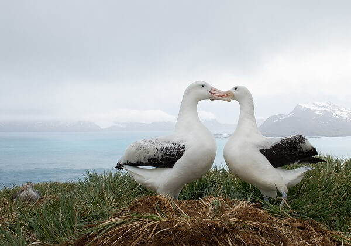

- The conservation status is Vulnerable
- There 20,100 mature individuals left in the wild
- The wingspan can be between 2.5 metres to 3.5 metres
- These birds mate for life and breed every two years
- They lay one egg that is white, with a few spots, and is about 10 cm long
- The biggest threat to their survival is longline fishing; however, pollution, mainly plastics and fishing hooks, are also taking a toll
- These birds tend to feed further out in open oceans than other albatrosses, and in colder waters
- The Wandering Albatross can live for over 50 years
- Their nest is a mound of mud and vegetation, and is placed on an exposed ridge near the sea
- Distances travelled each year are hard to measure, but one banded bird was recorded travelling 6000 km in twelve days

<figure>

<figcaption>

https://biologydictionary.net/wandering-albatross/

</figcaption>

</figure>
