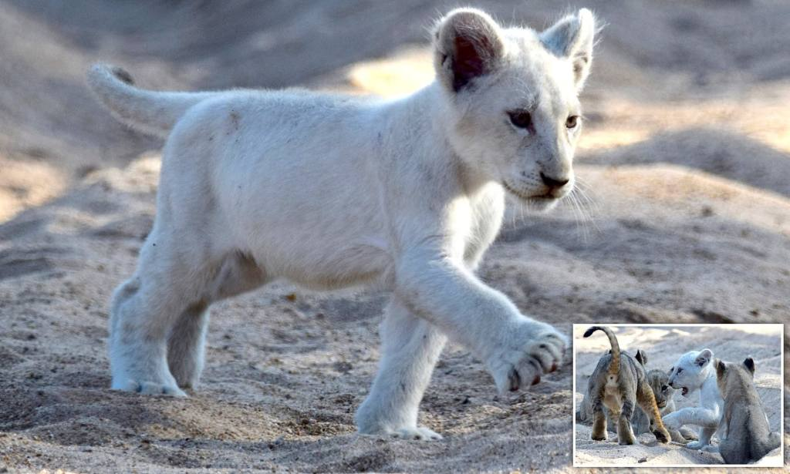
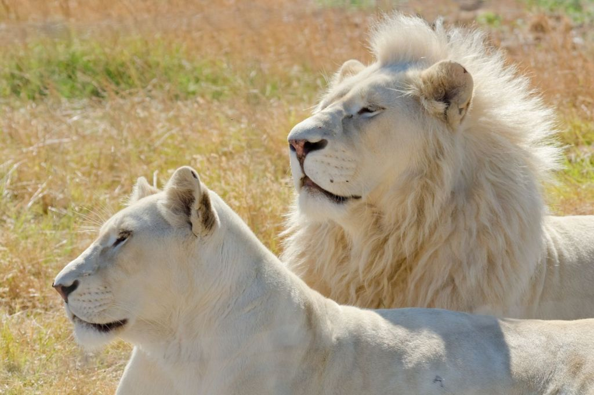

- The white lion is a rare colour mutation of the Southern African lion
- They are classed as vulnerable in their conservation status, the same the other lions
- White lions are symbols of leadership, pride, and royalty, and are viewed as national assets
- They hunt by stalking their prey in packs, patiently waiting for the right time to strike
- White lions in the area of Timbavati are thought to have been indigenous to that region
- White Lions are not albino, but due to a recessive gene called leucism
- The white lion colours are not seen to be a disadvantage in the wild, but it does increase their risk of being hunted commercially unfortunately
- There are currently only 13 white lions left in the wild, with the majority of white lions living in zoos across the world
- One organisation dedicated to conservation is the Global White Lion Protection Trust, and Stephanie has volunteered there many times on her trips to South Africa
- A lioness will give birth to between 2 and 4 cubs, and they rely on their mother for their first two years of life

<figure>

<figcaption>

[https://www.dailymail.co.uk/news/article-7297423/White-lion-cub-one-11-world-spotted-playing-mates-South-Africa](https://www.dailymail.co.uk/news/article-7297423/White-lion-cub-one-11-world-spotted-playing-mates-South-Africa)

</figcaption>

</figure>

<figure>

<figcaption>

[https://www.thoughtco.com/white-lion-4767233](https://www.thoughtco.com/white-lion-4767233)

</figcaption>

</figure>
