## Joburg Airport

As you can see, Stephanie and her companion are so excited and all geared up to going to the Global White Lion Protection Trust in Timbavati, South Africa.  We are waiting on our connecting flight to Hoedspruit at Joburg airport.

\[caption id="attachment\_1142" align="aligncenter" width="1944"\]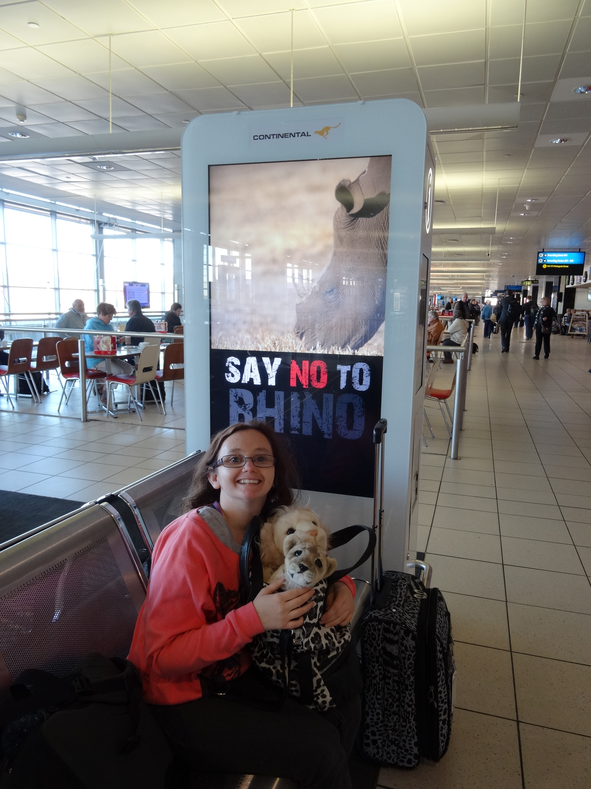 Waiting at Joburg for connecting flight to Hoedspruit\[/caption\]

## Hoedspruit South Africa

Arriving in Hoedspruit South Africa.  Our Wildlife Warrior has landed to start her amazing adventure.  Steph is well dressed for the part with her animal print motif.  

\[caption id="attachment\_1147" align="aligncenter" width="840"\] Arriving Hoedspruit airport\[/caption\]

## Beware of Lions sign 

I think we must be in Africa.  You don’t see those signs in Australia.

\[caption id="attachment\_1149" align="aligncenter" width="843"\]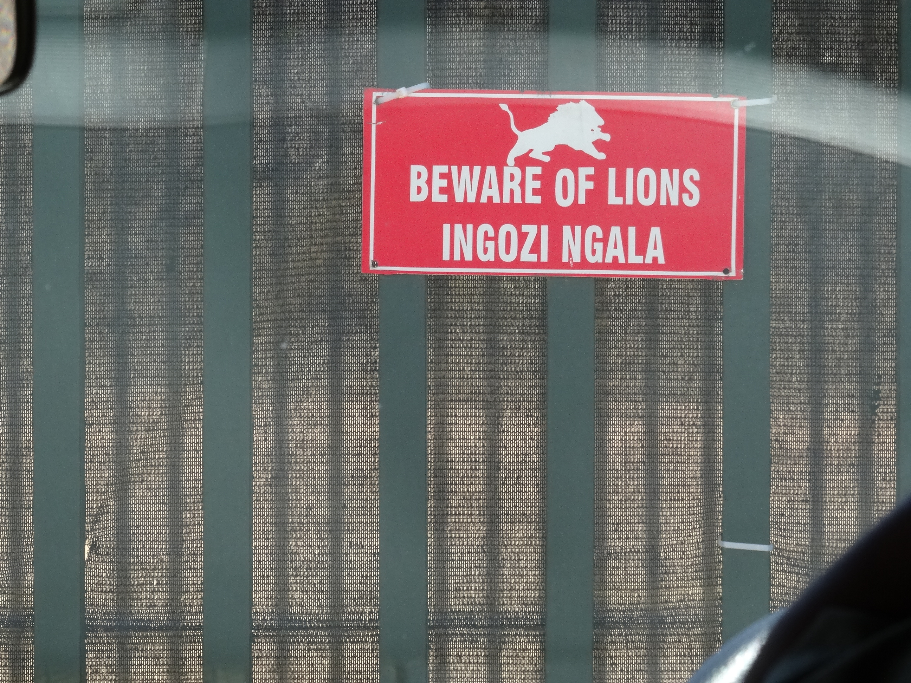 Beware of Lions\[/caption\]

## GWLPT 

GWLPT rules and regulations.  Very important notice – you don’t want to ignore these rules.

\[caption id="attachment\_1151" align="aligncenter" width="844"\]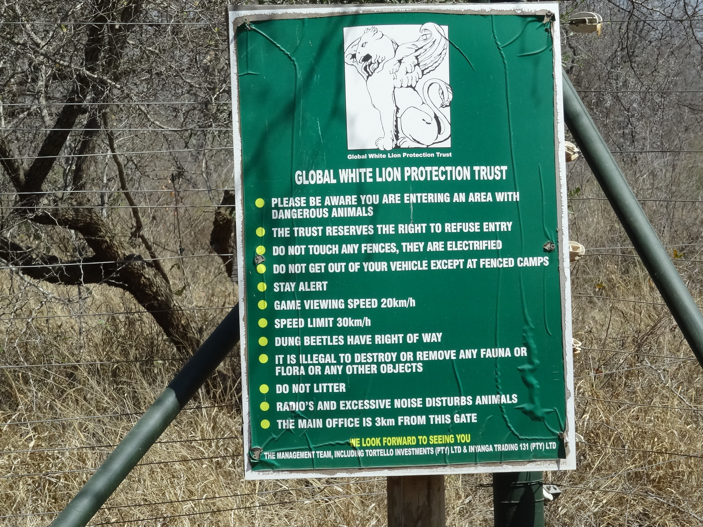 Sign on GWLPT Property\[/caption\]

## Akeru Brothers 

Matsieng and Zukhara are the sons of Queen Marah and King Mandla.

\[caption id="attachment\_1153" align="aligncenter" width="841"\]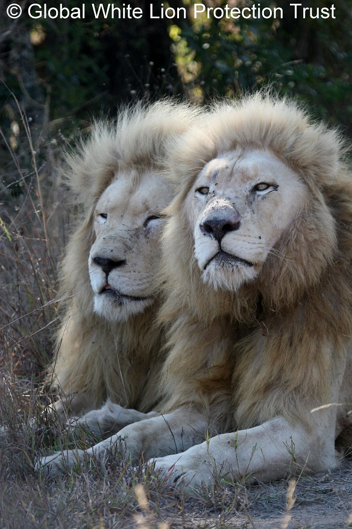 Akeru brothers 2\[/caption\]

## A photo of Queen Marah with Stephanie in the foreground

Queen Marah is the founder lioness, born in Bethlehem on Christmas day in 2000.

\[caption id="attachment\_1155" align="aligncenter" width="854"\]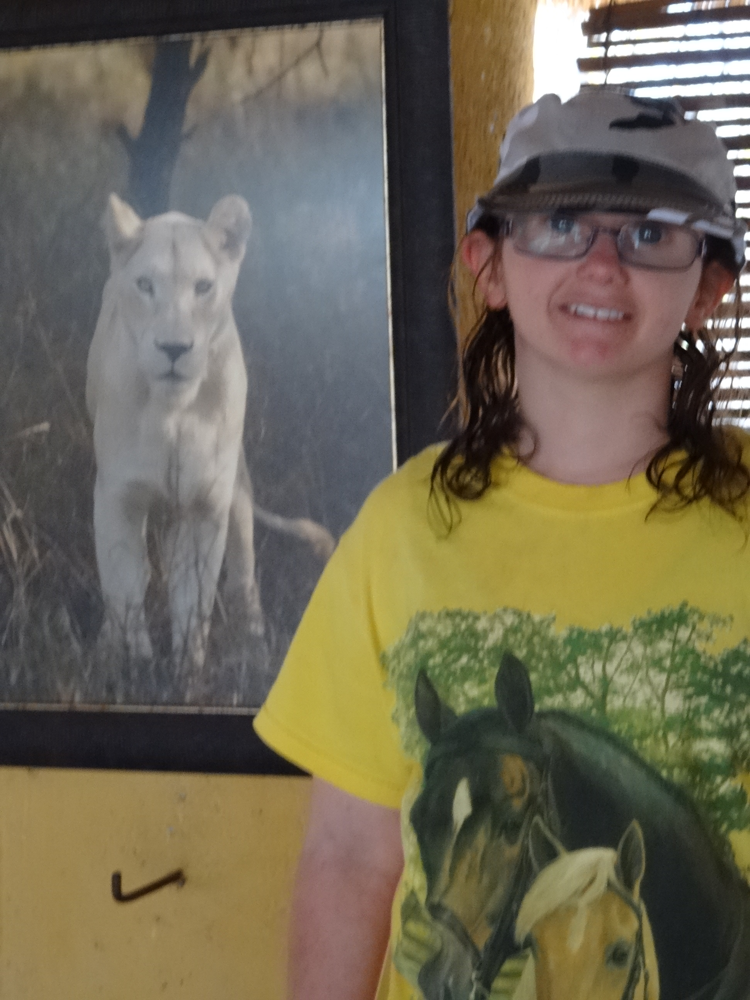 Stephanie with photo of first Lioness rescued by Lynda\[/caption\]

## Linda Tucker 

Photo of Linda Tucker and Stephanie at the Trust.  Linda is the Founder of the Global White Lion Protection Trust.  Stephanie presented her with a White Lion that we purchased the same day we booked our flights to South Africa.  Because of this first lion we sourced supply of these beautifully made toys from Quintillion – Barbara and Lawrence.

\[caption id="attachment\_1157" align="alignnone" width="846"\] Stephanie presenting Lynda Tucker Found … the GWLPT with a White Lion from Perth\[/caption\]

## GWLPT Visitor Camp

This is where Stephanie, John and Angy stayed for a week on their first visit to the GWLPT.  We were well looked after.  The Food was amazing, the people were so generous of spirit and kind.

\[caption id="attachment\_1159" align="aligncenter" width="1539"\]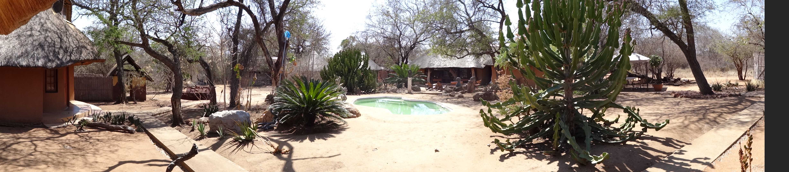 GWLPT Visitor Camp\[/caption\]

## Animal Safari

This was our very first Lion Monitoring Safari.  The Trust does two Lion monitoring Safari’s every day.  We were very blessed to have seen Matsieng and Zukhara on our very first drive.  Every day at the trust was a new adventure.  Seeing so many animals being protected by the Trust.

\[caption id="attachment\_1161" align="aligncenter" width="847"\]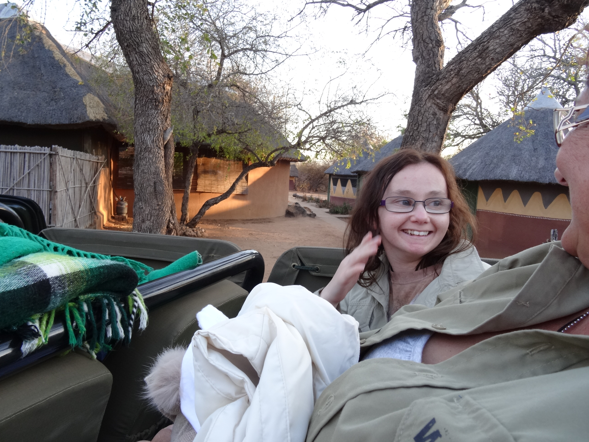 Preparing for first safari\[/caption\]

## Travel with Harmony

Harmony was our Safari guide.  He is the son of a chief in one of the local villages.  He will eventually become the chief himself.

\[caption id="attachment\_1163" align="aligncenter" width="844"\]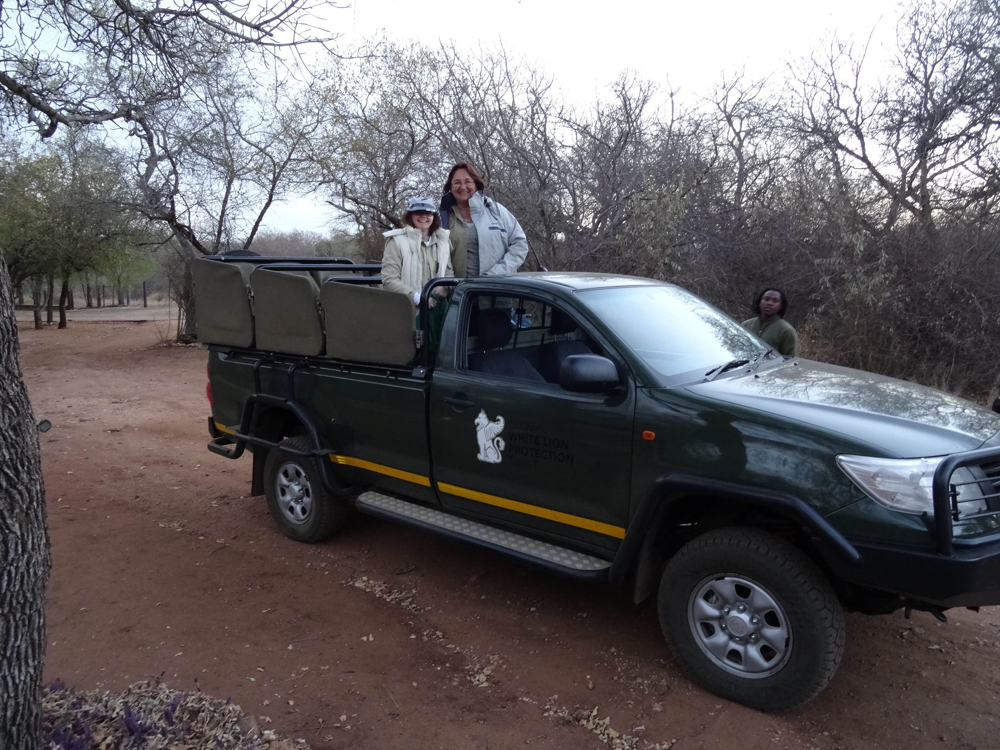 Harmony our guide to find Lions\[/caption\]

## Safari with Volunteers

John, Steph and Angy ready to go on the Safari with the Trust volunteers.

\[caption id="attachment\_1165" align="aligncenter" width="839"\] John, Steph and Angy with volunteers\[/caption\]

## Conservation Group 

Whilst holidaying at the Trust, we did some outings, one of which we went to the Hoedspruit Endangered Species Centre.  We saw many wonderful animals.

\[caption id="attachment\_1202" align="alignnone" width="2592"\]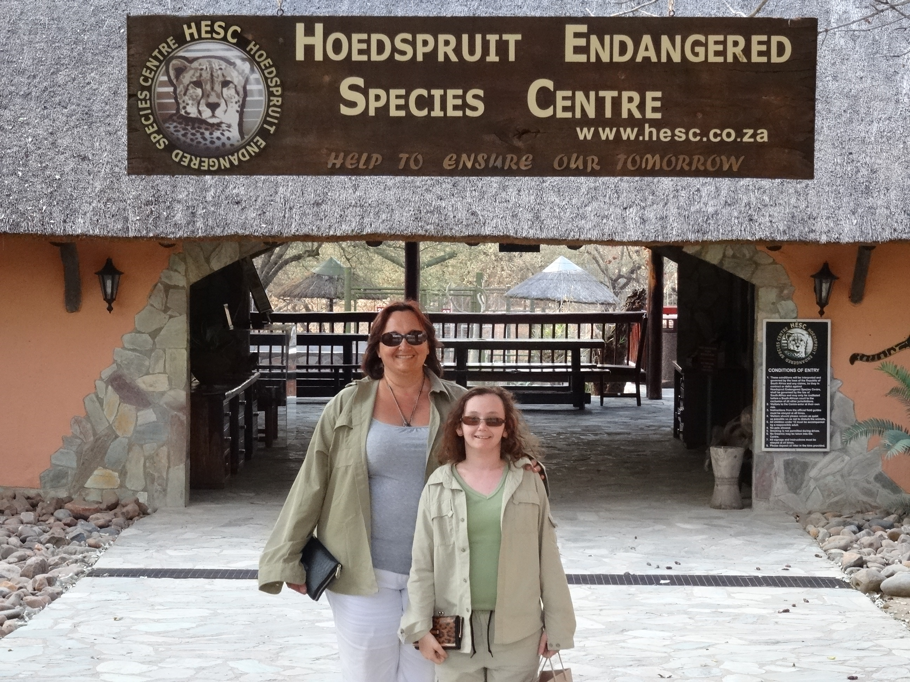 Conservation Group\[/caption\]

## Hoedspruit Endangered Species Centre

Seeing a White Lion on a Safari at the Hoedspruit Endangered Species Centre.  Steph’s passion for the White Lions became the start of Stephanie’s Big Cat Conservation Quest.  She is our Wildlife Warrior.

\[caption id="attachment\_1167" align="alignnone" width="839"\]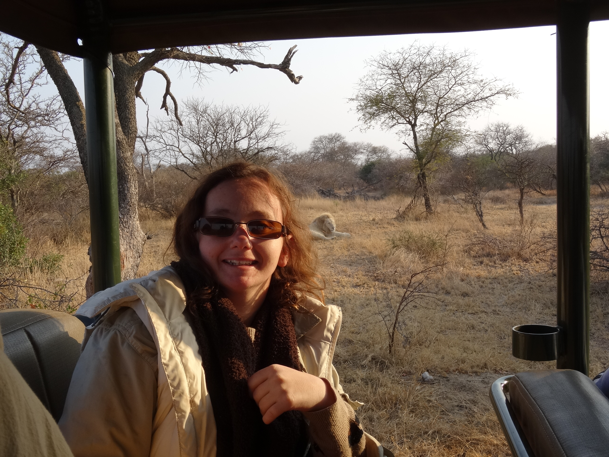 Seeing White Lion on Safari\[/caption\]

## Power Line Primary School

Stephanie and Harmony at Power Line Primary School, which is one of the education centers that the Global White Lion Protection Trust sponsors.

\[caption id="attachment\_1169" align="aligncenter" width="847"\]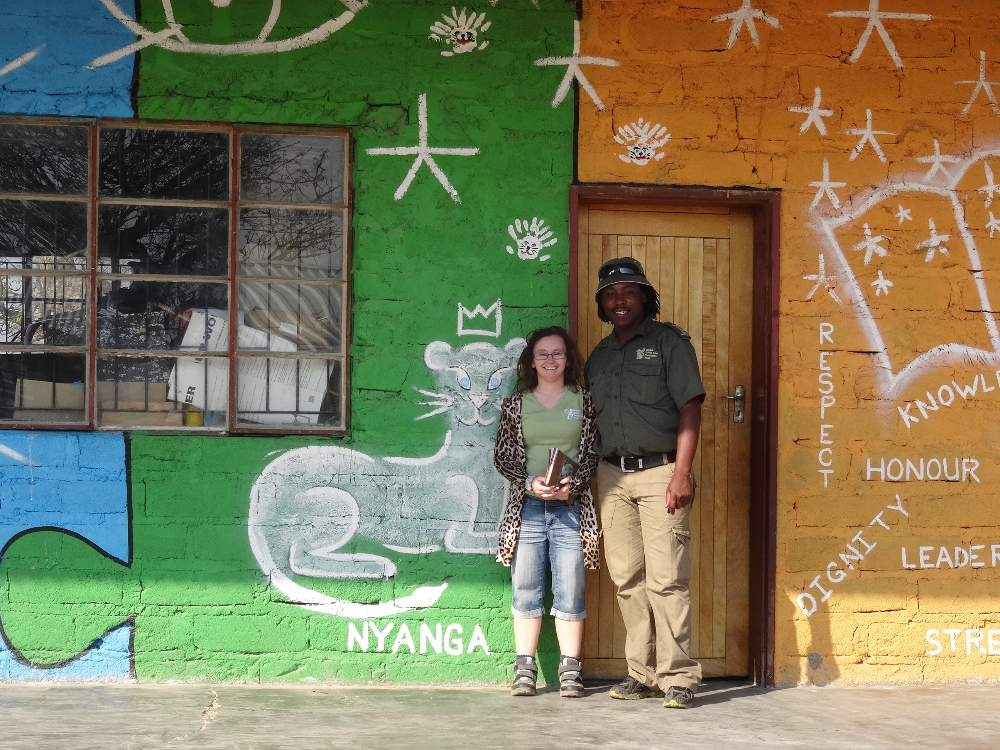 Stephanie and Harmony at the school\[/caption\]

## Power Line Primary School  classroom visit

Visiting a classroom of the Power Line Primary School.

\[caption id="attachment\_1172" align="aligncenter" width="840"\]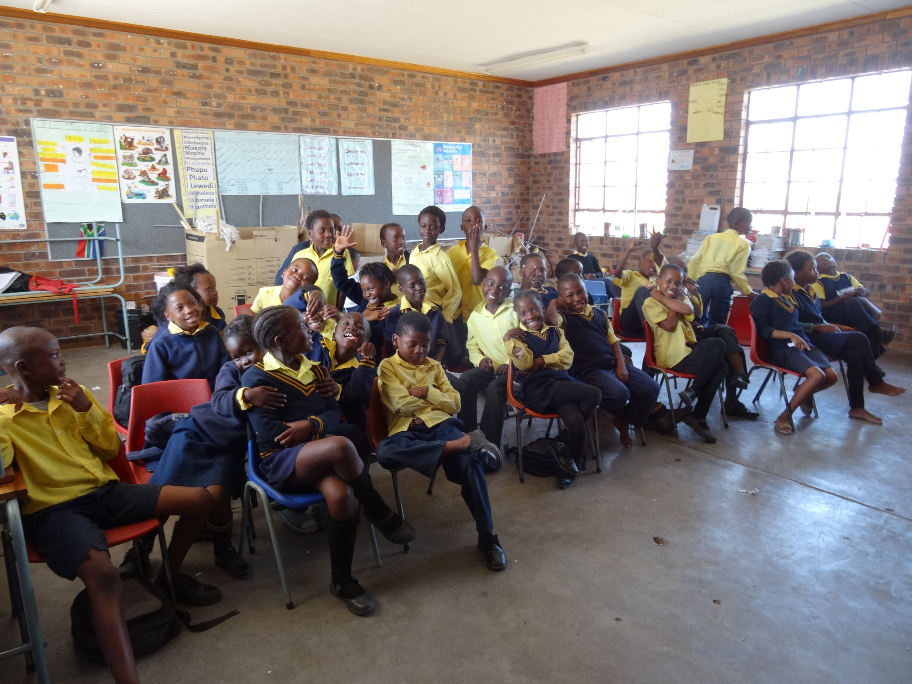 Power Line Primary School visit\[/caption\]

## Power Line Primary School Project

Steph getting involved with one of the school projects.

\[caption id="attachment\_1174" align="aligncenter" width="844"\]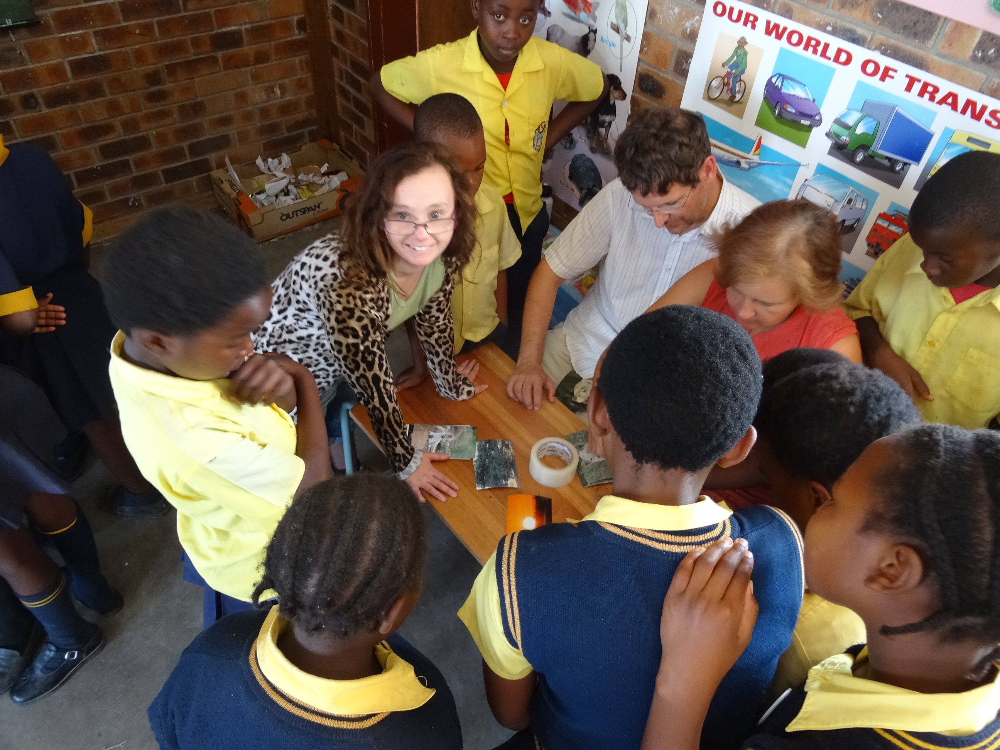 Power Line Primary School Classroom Students\[/caption\]

## Stephanie and Stephanie

This beautiful photo is of Stephanie and Stephanie.

\[caption id="attachment\_1176" align="aligncenter" width="871"\]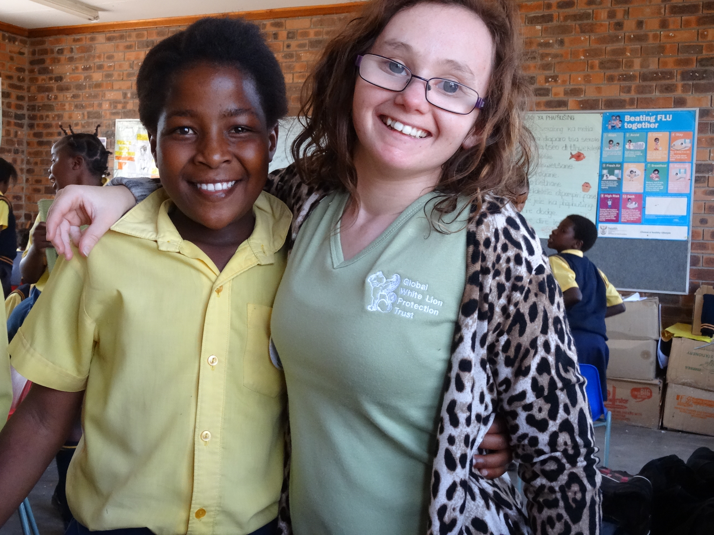 Stephanie and Stephanie\[/caption\]

## Jessica the Hippo

Jessica the Hippo is a very special Hippo.  She is world famous.  Her story can be found easily on the internet.  We were fortunate to meet her on one of our outings.

\[caption id="attachment\_1182" align="aligncenter" width="848"\]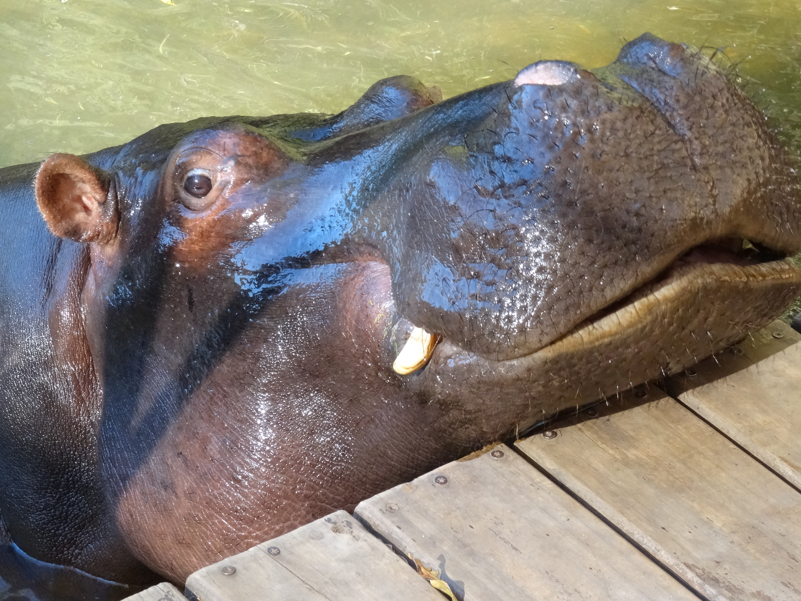 Jessica the Hippo\[/caption\]

## Feeding Time

Stephanie was brave enough to feed her some sweet potato.

\[caption id="attachment\_1183" align="aligncenter" width="843"\]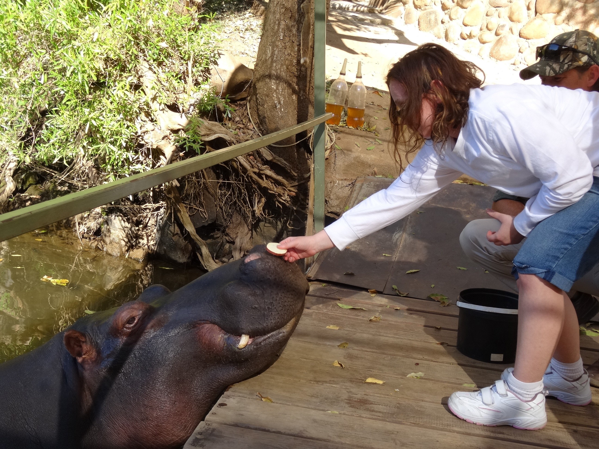 Stephanie feeding Jessica\[/caption\]

The custodian of Jessica asked Stephanie whether she would like to sit on Jessica’s back.  Stephanie was reluctant to do this but with the encouragement of the volunteers, she did sit on her back, and loved the experience.

\[caption id="attachment\_1185" align="aligncenter" width="839"\]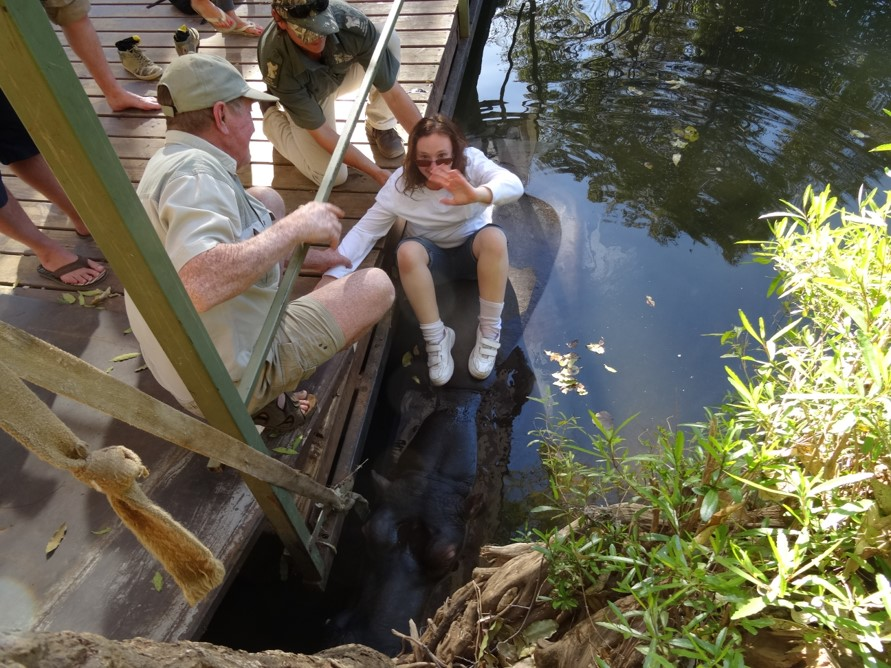 Stephanie sitting on Jessica the Hippo's back\[/caption\]

Just another view of this amazing experience.  With a smile.

\[caption id="attachment\_1188" align="aligncenter" width="853"\]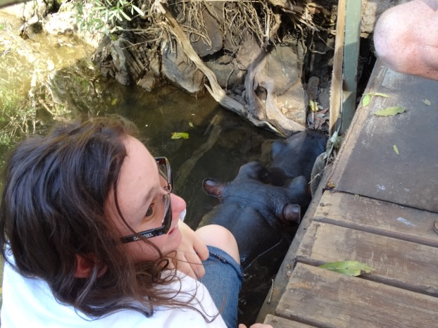 Stephanie sitting on Jessica the Hippo's back\[/caption\]

## Cheetah Inn

After our stay at the GWLPT we stayed a further few days at a local back packers establishment called the Cheetah Inn.  The owners were lovely and looked after our every need.

\[caption id="attachment\_1178" align="aligncenter" width="845"\]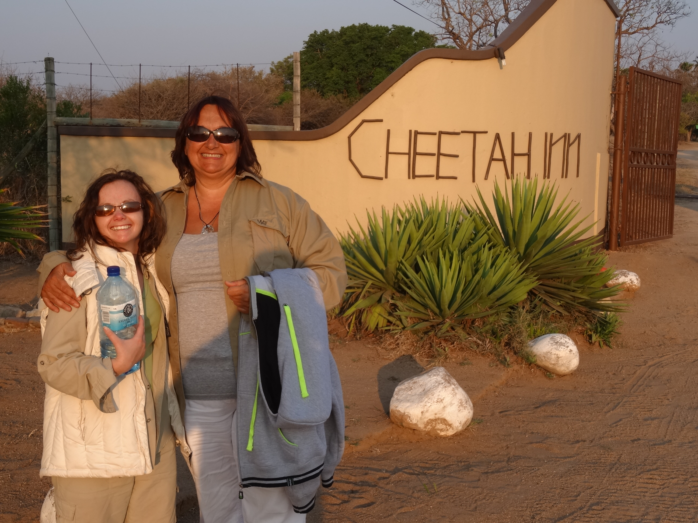 Cheetah Inn - Back Packers\[/caption\]

## Souvenir Shopping

This is one of the ways to shop in Hoedspruit.  Road side shopping.

\[caption id="attachment\_1180" align="aligncenter" width="840"\]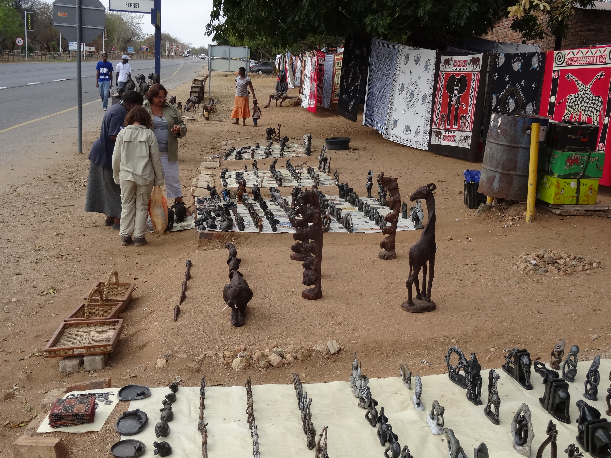 Souvenir Shopping\[/caption\]
