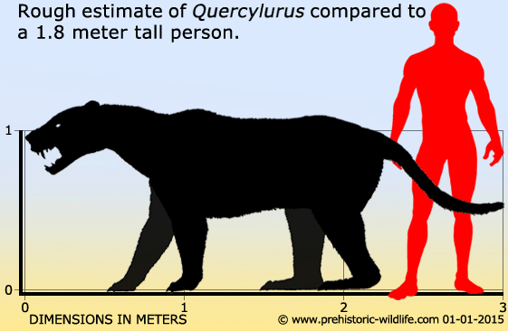

<figure>

<figcaption>

[http://www.prehistoric-wildlife.com/species/q/quercylurus.html](http://www.prehistoric-wildlife.com/species/q/quercylurus.html)

</figcaption>

</figure>

- Called the ‘Quercy Cat’ from the phosphorites (phosphate rock) in which it’s fossils were found in, in the former province of France, Quercy. 
- Quercylurus were carnivores
- Were around in the Oligocene period
- Mainly native to Europe, particularly what is now France
- They were around 3m long
- They were 1m high at the shoulder
- They weighed 230-400kgs
- It was unusually giant in comparison to other species in the same family. (The nimravid family)
- Classified as a ‘false sabre-tooth’cat
- They are not considered to be a relative of the true cat family but as instead classified as a ‘cat-like carnivore’

**References:**

[**http://www.prehistoric-wildlife.com/species/q/quercylurus.html**](http://www.prehistoric-wildlife.com/species/q/quercylurus.html)

**[https://prehistoric-fauna.com/Quercylurus-major](https://prehistoric-fauna.com/Quercylurus-major)**

[**http://www.prehistoric-wildlife.com/articles/false-sabre-toothed-cats-the-nimravids-and-barbourofelids.html**](http://www.prehistoric-wildlife.com/articles/false-sabre-toothed-cats-the-nimravids-and-barbourofelids.html)

[**https://en.wikipedia.org/wiki/Feliformia**](https://en.wikipedia.org/wiki/Feliformia)
