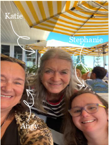
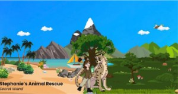
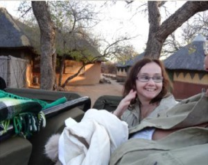

“May the choices you make today be forever in Earth's favour.”  
Who We Are  
Founded by mother-daughter duo, Angy and Stephanie, along with Stephanie’s mentor, Katie. It was founded in  
2013\. After a trip to South Africa to see Lions in the wild, they began their non-for-profit Environmental  
conservation organisation called STEPHANIE’s BIG CAT CONSERVATION QUEST (SBCCQ) to support, protect and  
appreciate wildlife for their beauty and importance.  
  
**Our VISION:** We have a vision to Respect the freedom of all Earth’s inhabitants.  
To create opportunities for learning about and appreciating the importance of  
our relationship as humans with animals and the profound impact of that  
relationship on the sustainability of life on Earth.  
**Our MISSION:** To educate all those individuals passionate and dedicated to  
conserving wildlife and their environment in an inclusive and accessible way.  
**Our VALUES:** Integrity, Respect, Creativity, Collaboration, and Authenticity.  
  
  
**Our journey to Save Animals: Monthly Game App Updates**  
Stephanie’s Animal Rescue – Secret Island, an engaging educational gaming app designed to raise awareness about animal conservation and deepen knowledge of the natural world. Players embark on a journey to save animals, learning about diverse species from around the world and immerse the players in real-world challenges these animals face. The game is unique as it uses Neuro Linguistic Programming (NLP) to enhance learning, memory, emotional engagement, and empathy for animal conservation.  
  
**Stephanie’s Animal Rescue – Secret Island: Progress to Date**  
The game has been progressing well, with multiple stories ready for  
production animal facts prepared for 20 stories and approximately 75% of artwork has been completed by  
Fiona Maddock, our Resident artist. Deakin UniHub and Deakin School of IT have been working closely with  
SBCCQ on various aspects of the Educational Game App, including Animal Fact sheets, Marketing, Study of how  
we compare to other similar Apps, as well as programming. Additionally Magic Studio’s Perth has been  
supporting our project with sound effects.  
  
  
  
  
**Become a member!**  
**Volunteer**  
Are you passionate about big cats and conservation? If you’d love to get yourself involved with a non-profit organisation, we’d love to have you as a volunteer at no cost! Contact us through our website to learn more.  
**Friends of SBCCQ**  
If you wish to stay informed about our journey sign up to our free Bulletin to receive monthly newsletter. **Supporters**  
If you’d like to make a difference but don’t have the time to get involved, we welcome your generous donations! Feel free to reach out for our bank details. We will be DGR compliant soon and will inform you once we have received DGR status.
  
**Supporting Conservation Groups**  
SBBCQ is dedicated to supporting conservation efforts to protect wildlife proven by our collaboration with other  
conservation groups.  
Global White Lion Protection Trust – CEO Linda Tucker  
The organisation, which was founded by Linda Tucker is committed to protecting White Lions, an endangered lion  
species. Stephanie has volunteered 6 years in a row, showing her commitment in protecting the endangered White  
Lions.  
Perth Zoo  
Stephanie frequently visits the Perth Zoo due to her love for animals, which is how we had the pleasure of meeting  
John Lemon, the Head Zookeeper at Perth.  
Love Lions Alive – CEO Andy Rive  
Stephanie has volunteered at Love Lions Alive in South Africa.  
Painted Dogs Conservation Inc Australia – CEO John and Angie Lemon  
Our meeting with John and Angie Lemon at a Perth Zoo led to our support for Painted Dogs Conservation.  
Sea Shepherd Australia  
Stephanie and Angy have shown support for Sea Shepherd Australia by volunteering to help clean local beaches in  
Perth.  
Koala Rescue Foundation  
When Stephanie was a member of Rotary of Scarborough, she spoke about the plight of Koala’s in Victoria after the  
big fires. This resulted with Rotary of Scarborough raising funds for the Koala Rescue Foundation as well as a band – Benny Mayhem, that travels around Australia playing music and raising funds for the Koala Rescue Foundation.  
  
  
  
Animal Awareness Day Facts!  
Each month different animals are celebrated to raise awareness of their world and In February there are 5  
animals:  
❖ World Pangolin Day – Pangolin, endangered scaly-skinned mammals vital in keeping our planet  
healthy, were celebrated on the third Saturday of February.  
❖ World Whale Day – Whales, magnificent marine mammals, were celebrated on the third Sunday of  
February.  
❖ World Bonobo Day – Bonobos, members of the great ape family, were celebrated on February 14th.  
❖ World Hippopotamus Day – Hippopotamus, large semi-aquatic mammal known for their powerful bite,  
were celebrated on 15th of February.  
❖ International Polar Bear Day – Polar bears, the largest bear in the world, were celebrated on the 27th  
of February  
Sponsors  
We extend our heartfelt thanks to the following sponsors whose support has been instrumental in  
advancing our journey as a non-profit organisation.
