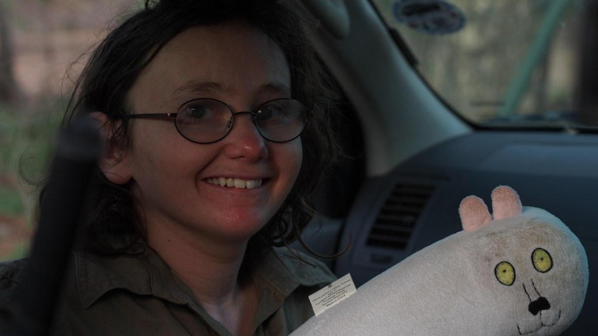
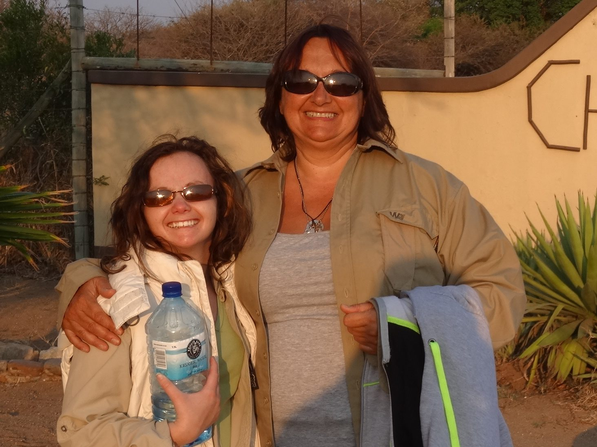
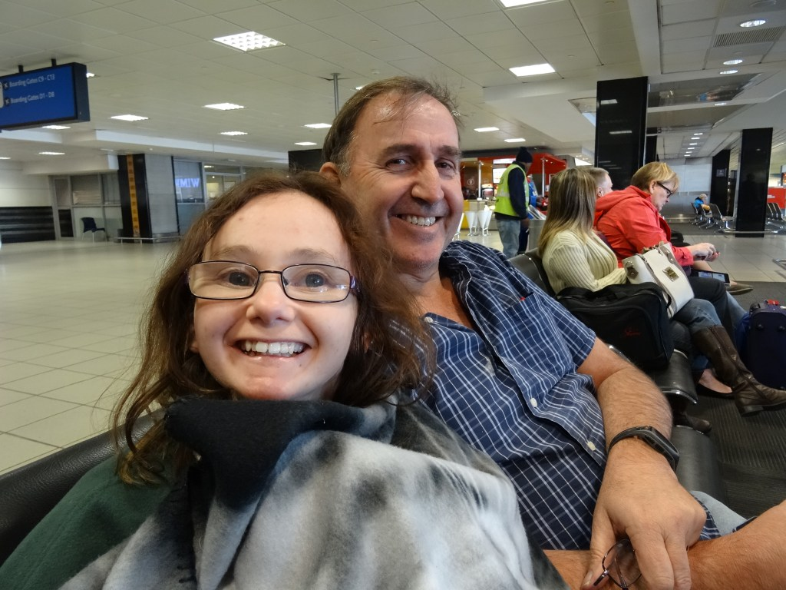

# Stephanie

Stephanie Haynes is the co-founder and ambassador of Stephanie’s Big Cat Conservation Quest. She is a very driven young woman, with a mild/moderate intellectual disability and a huge passion for big cats. Having wanted to go to South Africa to see them in their natural habitat her entire life, she finally made it for her 21st birthday.

Visiting the [Global White Lion Protection Trust](https://whitelions.org/) was a highlight in Stephanie’s life, and upon her return to Australia she promptly set about ensuring she could visit again and again. She has now been to the Trust to volunteer several times, with the assistance of her team here at SBCCQ. Stephanie’s major concern is the dwindling numbers of rare animals, especially the world’s big cats – and in particular her favourite, the white lion of Timbavati.

Stephanie is a member of Rotary of Scarborough and was awarded a diversity scholarship in 2011.  RoC supports Stephanie to achieve her passion; in 2015 Stephanie was awarded the Shine On Award from Rotary of Southern Districts for her community and conservation work. In addition to all this, Stephanie is an Gold Medal Olympian having participated as an equestrian in the Special Olympics in 2012-2014.

## ANGY

Angy is Stephanie’s mum, and co-founder of SBCCQ.  Angy shares her daughter’s passion for protecting the lives of the big cats, so that future generations can witness their wild majesty. Angy is also a member of Rotary of Crawley, and is the driving force behind SBCCQ.

## JOHN

John is Stephanie’s dad, and like all dad’s he supports his daughter’s dreams 100% Stephanie inspires him to be the best dad he can be.  Since his first trip in 2013 John has supported Steph with many fundraising events to support her dreams.

## KATIE

A fellow Rotarian, Katie is a great friend, wise mentor and inspirational teacher to Stephanie. Katie’s great ideas are a driving force for SBCCQ fundraising efforts. Katie’s tireless energy and loving ways keeps us on track and motivated.
