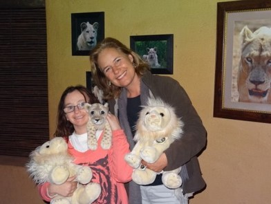
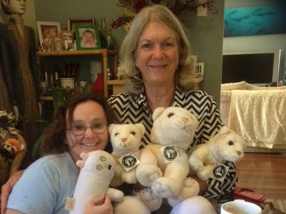

## Get Involved!

Would you like to help, but don't have the time!  Come along to one of our fundraising events or offer a donation on **[our Go Fund Me page](https://www.gofundme.com/f/sbccq-educational-conservation-game-app)** for one of our projects on the go.

Your generosity allows Stephanie's Big Cat Quest Inc. to raise funds to raise awareness for big cat conservation and other conservation projects on the go. **[Contact us](https://staging-c3e7-sbccq.wpcomstaging.com/contact/)** to find out more!

You can also get involved in supporting The Global White Lion Protection Trust by purchasing a white . We sell them at market stalls but you can order one through this website using our contact form!

<figure>

<figcaption>

Stephanie presenting Lynda Tucker Found … the GWLPT with a White Lion from Perth

</figcaption>

</figure>

<figure>

<figcaption>

3 shaved males that now look like females. Great job Katie.

</figcaption>

</figure>

## Volunteering

Stephanie’s Big Cat Conservation Quest is a dedicated wildlife conservation and educational organization. The most valuable assets in achieving our mission are our volunteers and contractors, who exemplify our core values, empowerment, inclusivity, mindfulness, and taking pride in our mission of “uniting all Australians to ensure wildlife thrive in a rapidly changing world.” We promote a healthy work/life balance that creates time for family, friends, and connecting with nature. We are always on the look out for more volunteers, so if you have a passion for big cats and conservation, we would like to hear from you!   
  
Please contact us via contact us page or search job opportunities in  **[Volunteering WA.](https://www.volunteeringwa.org.au/)**

## Fundraising Endeavours

SBCCQ is applying for grants to fund the development of an Educational Game App being created for Neurodiverse individuals as well as main stream individuals. Stephanie’s Big Cat Conservation Quest’s Project called Stephanie’s Animal Rescue – Secret Island, is a magical and imaginative mobile APP game for young children, adults and seniors with neurodiverse learning challenges.

We are seeking to raise funds for the development of these educational games for children, adults and seniors of all neurodiverse abilities.

Donations from family and friends always welcome. Stephanie’s Aunt and uncle are major supporters of SBCCQ. They have donated generously to help us develop our Educational Game App.

## Go Fund Me Page

Stephanie’s Big Cat Conservation Quest’s Project called Stephanie’s Animal Rescue – Secret Island, is a magical and imaginative mobile APP game for young children, adults and seniors with neurodiverse learning challenges. 

We are seeking to raise funds for the development of these educational games for children, adults and seniors of all neurodiverse abilities.

We do not have a functioning Go Fund Me page at the moment.

## Grants

SBCCQ Conservation Crusaders Pty Ltd are applying to Screen Australia for a Grant to develop a prototype for our Educational Game App.
