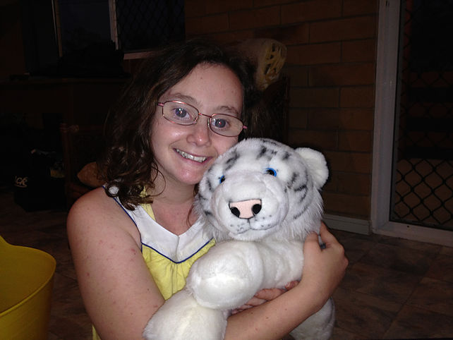
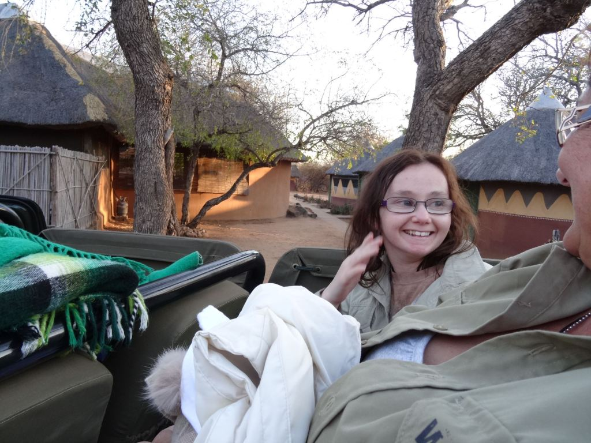
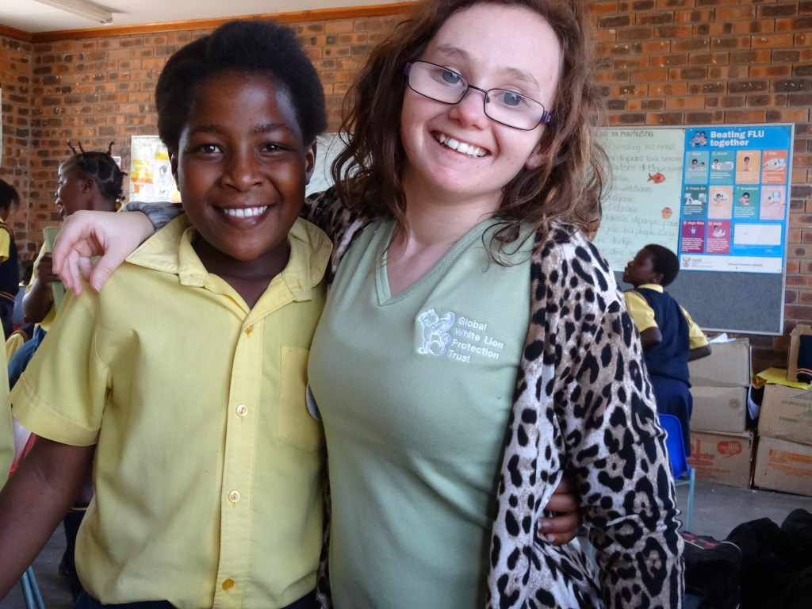
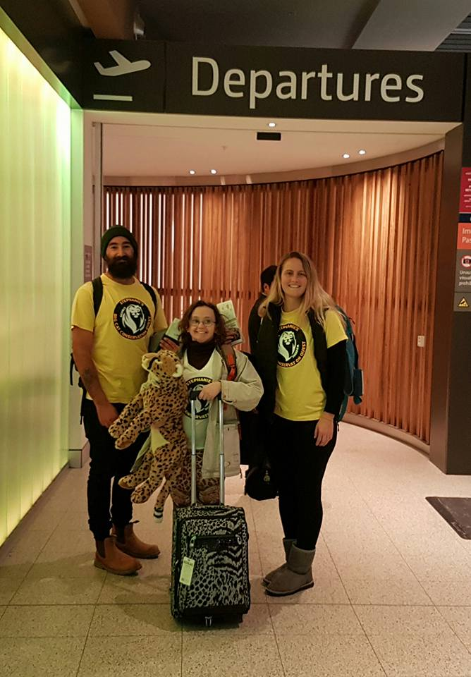
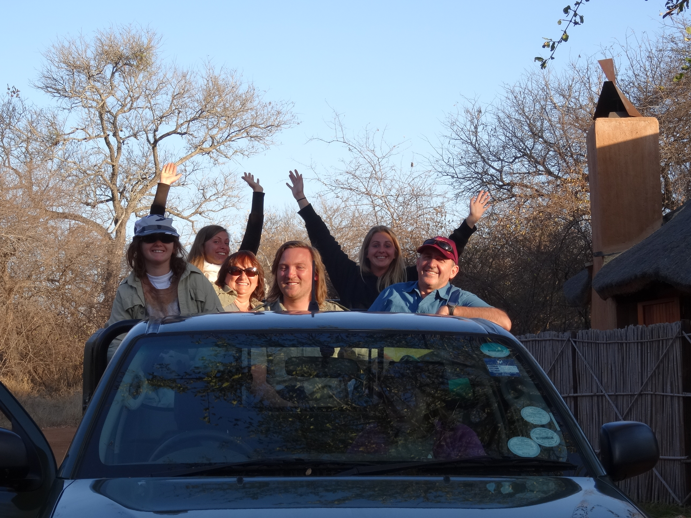

## **Hi there! Welcome to Stephanie's Big Cat Conservation Quest!**

### **"Within each of us lives the power to make a difference — a single passion can ignite change, inspire others, and shape a future of compassion, respect, and freedom for all."**

> SBCCQ Inc. is a small, dedicated and driven conservation team based in Perth, Western Australia with a mission to save our wildlife and our environment. SBCCQ Inc. was founded by two very special women: Stephanie and her mother Angy.

Angy is Stephanie’s mum, and a co-founder of SBCCQ. Angy shares her daughter’s passion for protecting our wildlife, so that future generations can appreciate their beauty and importance.

 

## **How You Can Help**

 

### **Become a Volunteer**

SBCCQ are seeking many Volunteers for different roles. If conservation is high on your personal values list, contact us and we will welcome you with open arms and get you involved with a great project alongside our team.

[Volunteer](https://staging-e90a-sbccq.wpcomstaging.com/contact/)

